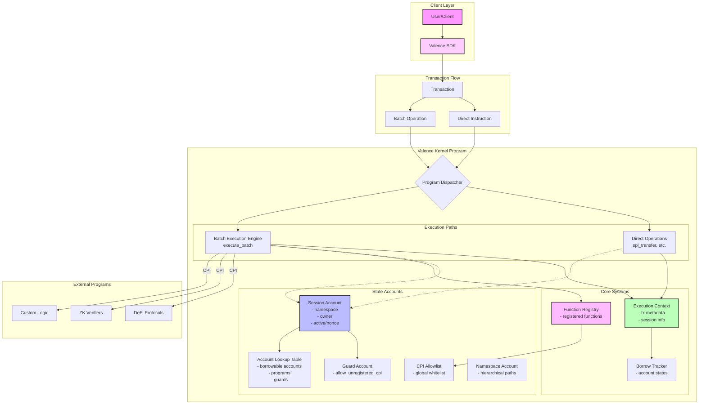

# Valence Kernel Architecture

## 1. Overview

The Valence Kernel is a minimal, secure execution environment for the Solana blockchain that provides a foundation for building complex, stateful applications without prescribing specific authorization models. The kernel follows an "on-chain linker" philosophy, abstracting away Solana's account model while maintaining security through explicit account registration and capability-based access control.

At its core, the kernel provides Session Accounts, isolated execution contexts that maintain their own account registries, security configurations, and namespace organization. The kernel provides essential security mechanisms, including account isolation, borrowing semantics, and CPI controls, without prescribing specific policies, allowing protocols to compose these mechanisms into their own authorization models.

## 2. Architectural Diagram



## 3. Core Components

### 3.1. Session Account

The Session Account is the primary execution context in the kernel. Each session maintains its position in the namespace hierarchy (such as "defi/lending/alice") and tracks its owner. The session references both its guard configuration, which contains security settings like the `allow_unregistered_cpi` flag, and its Account Lookup Table for managing accessible accounts. To handle concurrent operations safely, sessions track borrowed accounts across 8 slots using an efficient bitmap. The active status and nonce fields enable clean ownership transfer through session invalidation, supporting move semantics without shared mutable state.

Sessions implement borrowing semantics to safely manage concurrent account access, with a bitmap tracking which slots are occupied for O(1) lookups.

### 3.2. Account Lookup Table (ALT)

Each Session has a dedicated Account Lookup Table (ALT) that serves as a secure registry of pre-approved accounts. The ALT can store up to 8 borrowable accounts with specified read/write permissions, 8 programs authorized for Cross-Program Invocation, and 8 guard configurations (though the latter is a legacy feature maintained for compatibility). This pre-registration approach eliminates Solana's `remaining_accounts` pattern and provides strong security boundaries by ensuring sessions can only interact with explicitly declared accounts.

### 3.3. Hybrid Execution Model

The kernel intentionally provides two complementary execution paths, each serving distinct and important use cases:

**Direct Operations** - Optimized, single-purpose instructions for common, well-defined operations. Examples include `spl_transfer` for token transfers, `manage_alt` for ALT modifications, and `invalidate_session` for ownership transfer. These provide maximum performance and clarity for frequent tasks by bypassing the generic execution engine.

**Batch Operations** - A flexible execution engine accessed through `execute_batch` for complex scenarios that require:
- Dynamic operation sequences not known at compile time
- Asynchronous message handling
- Atomic execution of multiple operations
- Runtime-determined account sets
- Complex state transitions that span multiple programs

The batch system supports up to 12 accounts and 5 operations per batch, with CPI operations limited to 64 bytes of data and 12 account indices maximum.

The batch system implements an "on-chain linker" model where clients provide flat account lists with operations referencing them by index. It supports four operation types: BorrowAccount and ReleaseAccount for account management, CallRegisteredFunction for invoking registered programs, and UnsafeRawCpi for direct program invocation when explicitly allowed.

This hybrid approach balances architectural clarity with practical flexibility. While direct operations are preferred for their simplicity and performance, batch operations remain essential for real-world use cases that don't fit into predetermined patterns. The kernel explicitly embraces both models as first-class citizens rather than treating batch operations as a legacy or compromise.

### 3.4. Security Model

The kernel provides foundational security mechanisms that protocols compose into comprehensive policies. At the core is the Guard Account - a minimal configuration object linked to each session that contains the `allow_unregistered_cpi` flag, ensuring arbitrary program call capability is an explicit choice.

Beyond this central security control, the kernel ensures transaction atomicity where all instructions succeed or fail together, preventing partial state corruption. A global CPI allowlist maintains system-wide approved programs that any session can safely invoke. The function registry allows well-known program addresses to be referenced by simple numeric IDs rather than full public keys. Protocols combine these mechanisms into their specific security policies through careful transaction structure and instruction sequencing.

### 3.5. Function Registry

A hardcoded mapping of function IDs to program addresses, enabling:
- **Well-known Functions**: ZK verifiers, price oracles, etc.
- **Committee Management**: Security-critical functions managed by committees
- **Protocol Extensions**: DeFi protocols register their functions

Example registry entries:
```rust
1001 => ZK_VERIFIER_PROGRAM
2001 => PRICE_ORACLE_PROGRAM
3001 => LENDING_PROTOCOL_PROGRAM
```

### 3.6. Execution Context

Every operation executes within a rich ExecutionContext that captures the complete environmental state. This includes transaction metadata such as the current slot, epoch, and the account that submitted the transaction. The session context provides the session key, namespace path, and caller identity. Temporal data like the current timestamp enables time-based logic. Together, this comprehensive context allows operations to make informed decisions based on who initiated the action, when it occurred, and within what namespace hierarchy it's operating.

### 3.7. Borrowing Semantics

Sessions gain the ability to borrow accounts through their Account Lookup Table (ALT), which pre-registers up to 8 accounts with specific read/write permissions. When executing operations, the session can only borrow accounts that have been explicitly added to its ALT. This pre-registration requirement ensures sessions cannot access arbitrary accounts, providing a strong security boundary.

Once authorized through the ALT, sessions track borrowed accounts using an array of eight SessionBorrowedAccount slots and an efficient bitmap for O(1) slot tracking. The system provides BorrowAccount operations that specify the account index (referencing the ALT) and access mode, paired with ReleaseAccount operations to return borrowed accounts when no longer needed. This two-layer system—ALT pre-registration, followed by explicit borrowing thereafter—ensures security and efficient resource management.

### 3.8. Namespace System

The namespace system provides hierarchical organization with arbitrary depth, allowing paths like "protocol/subprotocol/user" within a 256-byte limit. The system implements one-way trust where parent namespaces can access their children's state but not vice versa, creating natural administrative boundaries. Namespace paths are used for PDA derivation, providing deterministic addresses for each namespace. The use of fixed-size storage prevents griefing attacks that could exploit variable-length data.

### 3.9. Direct Account Creation

Sessions can create child accounts through direct operations using the `create_child_account` instruction, enabling dynamic use cases within their namespace hierarchy. Child accounts are created under the session's namespace (e.g., "defi/lending/alice/temp1") with specified initial lamports, space allocation, and owner program.

Child accounts inherit the security constraints of their parent session and are automatically borrowable by the creating session without ALT registration. This design enables patterns like temporary storage, factory-created token accounts, and dynamic metadata while maintaining the kernel's security guarantees through namespace isolation and privilege inheritance.

## 4. Advanced Features

### 4.1. Move Semantics & Session Invalidation

The kernel provides primitives for clean ownership transfer without shared mutable state. Sessions include an active flag that can be set to false for invalidation and a nonce that increments on ownership changes. The SDK provides patterns like InvalidationMove for transferring by invalidating the old session, CloseAndRecreateMove for complete account closure, and OwnershipVersion for versioned ownership tracking.

### 4.3. CPI Security Layers

The kernel implements CPI security through three complementary mechanisms.
1. A global allowlist maintains system-wide approved programs that any session can safely invoke.
2. Each session's Account Lookup Table provides session-specific program authorization.
3. The guard configuration provides an opt-in flag, meaning developers must explicitly choose to allow unrestricted CPI access.

## 5. System Integration Flow

A typical operation flows through several stages within the kernel. It begins with client preparation, where the SDK constructs either a direct instruction or a batch of operations, with accounts referenced by indices into a flat array for efficiency.

When the transaction reaches the kernel, session validation occurs first. The kernel verifies the session is active, confirms the caller has authorization, and loads the associated guard configuration and Account Lookup Table.

During operation execution, the kernel either parses and validates a batch of operations or jumps directly to a specific handler for direct instructions. An ExecutionContext is constructed containing all relevant transaction metadata.

Account resolution follows, where the kernel looks up each referenced account in the session's ALT, validates the required permissions, and tracks any borrows in the session state to prevent conflicts.

If Cross-Program Invocation is required, the kernel performs additional security checks against the global allowlist and verifies the allow_unregistered_cpi flag if needed. CPI depth is tracked to prevent stack overflow attacks.

Finally, the kernel updates all relevant state including borrow tracking, usage counters, and operation logs, ensuring the session accurately reflects the completed operations.

**ZK-Verified Transfer Example:**

1. Client generates ZK proof locally
2. Transaction contains:
   - CallRegisteredFunction(ZK_VERIFIER_ID, proof_data)
   - CallRegisteredFunction(TRANSFER_ID, transfer_params)
3. Kernel executes atomically:
   - Verifier validates proof
   - Transfer executes only if proof valid
4. Session state updated

## 6. Design Philosophy

The kernel embodies "mechanisms, not policies" - providing minimal security primitives that protocols compose into their own authorization models rather than prescribing specific patterns. Unlike traditional smart contracts that rely on reentrancy guards and complex permissions, Valence achieves security through simplicity: fixed-size data structures, explicit account registration, and transaction-level atomicity. Performance comes through specialization with direct operations for common cases and batch execution for complex flows, while the SDK abstracts complexity to deliver a predictable developer experience where security properties are immediately apparent from the transaction structure itself.

## 7. Design Rationale

### Why a Hybrid Execution Model?

The kernel's dual execution paths address a fundamental tension in blockchain development: the need for both simplicity and flexibility. Direct operations handle the 80% case - common, well-understood operations that benefit from optimization and clarity. However, real-world applications frequently need:

- **Atomic multi-step operations**: Complex DeFi strategies that must succeed or fail as a unit
- **Dynamic account resolution**: Operations where the exact accounts aren't known until runtime
- **Async message processing**: Handling events from other programs or off-chain sources
- **Conditional execution flows**: Operations that branch based on runtime state

Batch operations provide this flexibility without compromising security. Rather than forcing developers to split complex operations across multiple transactions (expensive and risky), the kernel enables atomic execution of dynamic operation sequences.

### Why Hierarchical Namespaces?

The namespace system is a primitive that enables:

- **Hierarchical permission models**: Natural administrative boundaries where parents can manage children
- **Dynamic child account creation**: Safe runtime account creation within namespace boundaries
- **Organizational structure**: Protocols can mirror real-world hierarchies (protocol/market/user)
- **Future governance capabilities**: Namespace ownership can evolve into governance rights

The fixed-size implementation prevents griefing attacks while maintaining O(1) PDA derivation. This is a classic example of the kernel providing mechanisms (namespace hierarchy) that protocols compose into policies (access control).

### Security Flags vs Policies

The `allow_unregistered_cpi` flag in GuardAccount exemplifies the kernel's "opt-in to risk" philosophy. This isn't a policy violation but rather a capability flag that makes risk explicit. Consider the alternatives:

1. **Always allow arbitrary CPI**: Unsafe by default
2. **Never allow arbitrary CPI**: Too restrictive for innovative protocols
3. **Complex permission system**: Adds overhead and complexity

The simple boolean flag achieves the security goal (safe by default) while enabling advanced use cases (explicit opt-in). Developers must consciously choose to enable unrestricted CPI, making the security implications clear.

### Fixed-Size Data Structures

Throughout the kernel, we use fixed-size arrays rather than dynamic vectors. This design choice:

- **Prevents heap allocation attacks**: No unbounded memory growth
- **Enables precise compute budgets**: Operations have predictable costs
- **Simplifies security audits**: All bounds are explicit in the type system
- **Improves performance**: Stack allocation is faster than heap allocation

While this requires careful size selection, the security and performance benefits far outweigh the minor inconvenience of predetermined limits.
