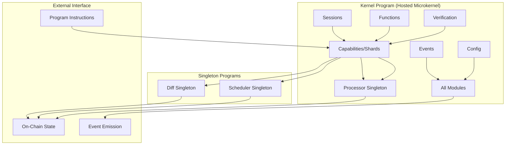

# Valence Protocol Architecture Overview

The Valence Protocol implements a hosted microkernel architecture - a single Solana program that provides a clean, modular kernel hosting multiple application domains with well-defined interfaces and isolation boundaries.

## Architecture Overview

## Design Principles

### Hosted Microkernel Benefits
The hosted microkernel approach provides simplified deployment and versioning through a single deployment unit. Direct function calls enable maximum performance with zero IPC overhead. Modules share state efficiently while maintaining unified error handling for consistent error propagation and recovery. Cross-module transactions support atomic operations with rollback capability.

### Modularity Through Design
The system maintains clean interfaces with well-defined module boundaries and APIs. Each module has a single, focused responsibility following separation of concerns principles. Modules interact through defined contracts maintaining loose coupling, while related functionality is grouped within modules for high cohesion.

## Documentation Structure

| Document | Purpose |
|----------|---------|
| [Kernel Architecture](./002-unified-kernel.md) | Kernel program structure and module organization |
| [Data Flow](./003-data-flow.md) | Request lifecycle and state transitions |
| [API Reference](./004-api-reference.md) | Complete instruction and account reference |
| [Integration Patterns](./005-integration.md) | How modules work together |

### Module Deep Dives

| Module | Purpose | Documentation |
|--------|---------|---------------|
| Sessions | Session lifecycle management | [sessions.md](./102-sessions.md) |
| Capabilities | Capability definitions & scoping (with embedded eval) | [capabilities.md](./103-capabilities.md) |
| Functions | Function registry & composition | [functions.md](./104-functions.md) |
| Verification | Verification function system | [verification.md](./105-verification.md) |
| Events | Event coordination system | [events.md](./106-events.md) |

### Singleton Programs

| Singleton | Purpose | Key Features |
|-----------|---------|--------------|
| Processor | Stateless execution orchestration | Verification chain coordination, context building, resource management |
| Scheduler | Multi-shard scheduling | Queue management, partial order composition, priority scheduling |
| Diff | State diff operations | Diff calculation, batch optimization, atomic processing |

## Quick Start

For implementation examples and usage patterns, begin with the Core Architecture document to understand the overall structure, then review Data Flow to see how requests flow through the system. The API Reference provides available instructions and accounts, while individual module documentation covers specific functionality you're implementing.

## Key Concepts

Capabilities are executable units with defined permissions and constraints. Sessions provide execution contexts that group related operations. Functions serve as composable building blocks for complex operations. Verification consists of pure functions that validate execution conditions. Events provide the coordination mechanism for cross-module communication. 