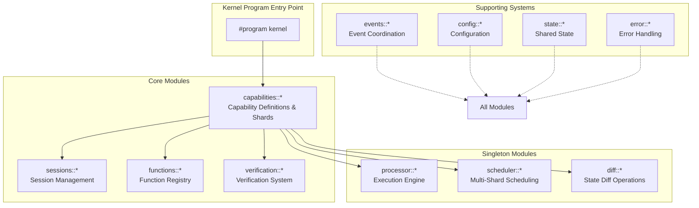
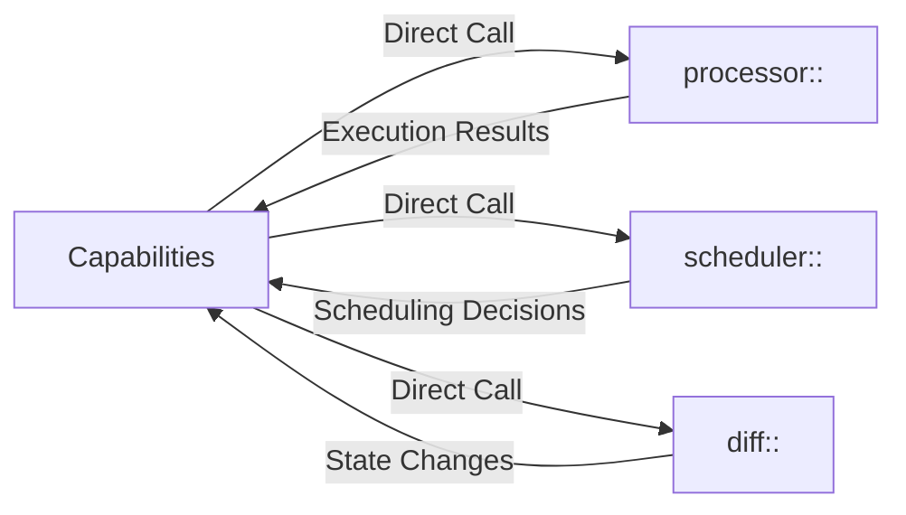

# Kernel Program Architecture

The Valence Protocol kernel program implements a hosted microkernel that provides a unified execution environment for capability-based operations on Solana.

## Module Organization

## Module Responsibilities

### capabilities:: Capability Definitions & Shards
The capabilities module defines capabilities and manages shard-based execution. It includes shard state management in state.rs, capability scoping and permissions in scoping.rs, execution context and results in execution.rs, and capability-related instructions in instructions.rs. The module manages capability definition and validation, shard-based state management, execution context building, and permission boundary enforcement.

### sessions:: Session Lifecycle Management
The sessions module manages session creation, activation, and lifecycle. It includes session configuration and permissions in state.rs, session factory and management in lifecycle.rs, session isolation and security in isolation.rs, and session-related instructions in instructions.rs. The module handles session creation and activation, permission and configuration management, session isolation and security boundaries, and optimistic session handling.

### functions:: Function Registry & Composition
The functions module manages the function registry and enables composition. It includes function discovery and registration in registry.rs, function execution coordination in execution.rs, function composition management in metadata.rs, and function-related operations in instructions.rs. The module handles function registration and discovery, function chain composition, function aggregation patterns, and metadata management.

### verification:: Verification Function System
The verification module executes verification functions for capability validation. It contains core verification predicates in predicates.rs, permission verification in basic_permission.rs, system-level authorization in system_auth.rs, session validation in session_creation.rs, parameter validation in parameter_constraint.rs, block height verification in block_height.rs, and zero-knowledge proof verification in zk_proof.rs. The module manages pure verification function execution, multi-layered verification composition, verification result aggregation, and pluggable verification architecture.

## Inter-Module Communication

### Direct Function Calls
Most module interactions use direct function calls for maximum performance:

### Event-Based Coordination
For cross-cutting concerns and loose coupling:

### Shared State Access
Modules access shared state through well-defined interfaces. For example, the capabilities module can access session state from the session account and build execution context using the loaded session configuration.

### Singleton Module Integration
The kernel program includes three singleton modules as part of the unified program:

- **processor::** Handles stateless execution orchestration with verification chains
- **scheduler::** Manages multi-shard scheduling and partial order composition
- **diff::** Calculates and optimizes state diffs for atomic updates

## Instruction Flow

### Main Program Instructions
The kernel program exposes four primary instructions:

### Module Instruction Patterns
Each module follows consistent patterns for instruction handling. They verify accounts and permissions during context validation, load required state from accounts, execute module-specific business logic, update accounts with new state, emit relevant events, and return success or error results.

## Security & Isolation

### Permission Boundaries

### Isolation Mechanisms
The system provides namespace scoping where objects are accessible only within defined namespaces. Session boundaries constrain operations to session permissions. Capability limits restrict functions to capability definitions. Verification gates provide multi-layer verification before execution.

## Performance Optimizations

### Direct Call Optimization
The architecture eliminates inter-process communication overhead through direct function calls. Modules use shared memory access patterns and benefit from compile-time optimization across modules.

### State Access Patterns
The system employs efficient account loading and caching strategies. It minimizes state transitions and uses batch operations where possible.

### Execution Optimization
The architecture supports inline verification execution, optimistic execution patterns, and lazy evaluation strategies to maximize performance. 