# System Data Flow

This document describes how data flows through the Valence Protocol system, from initial requests through execution completion.

## Request Lifecycle Overview

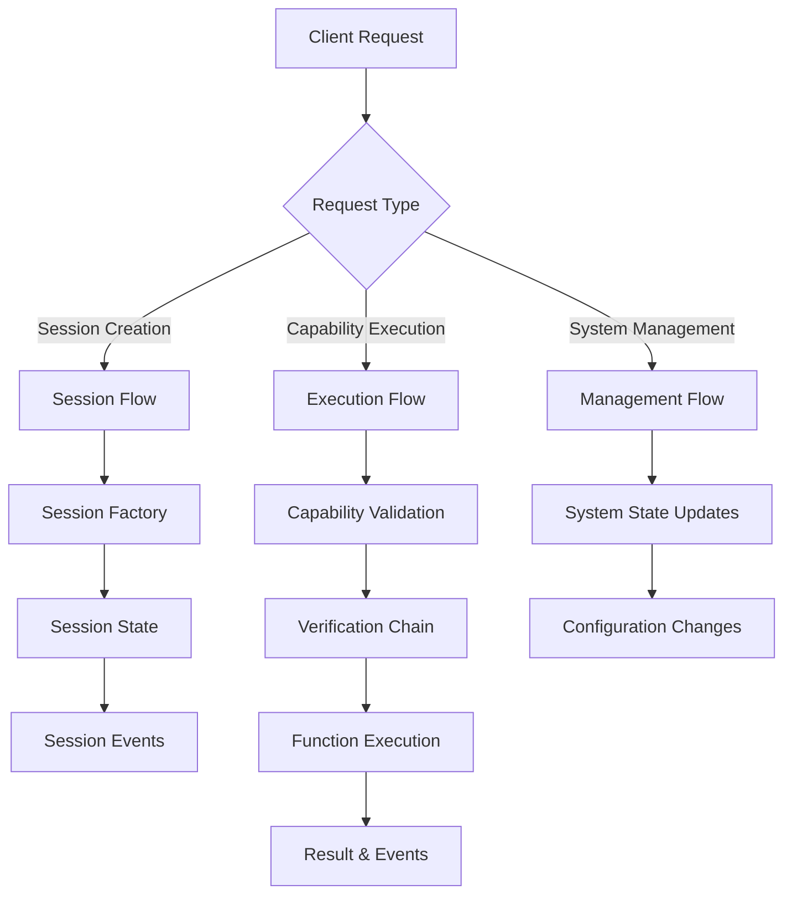

## Session Creation Flow

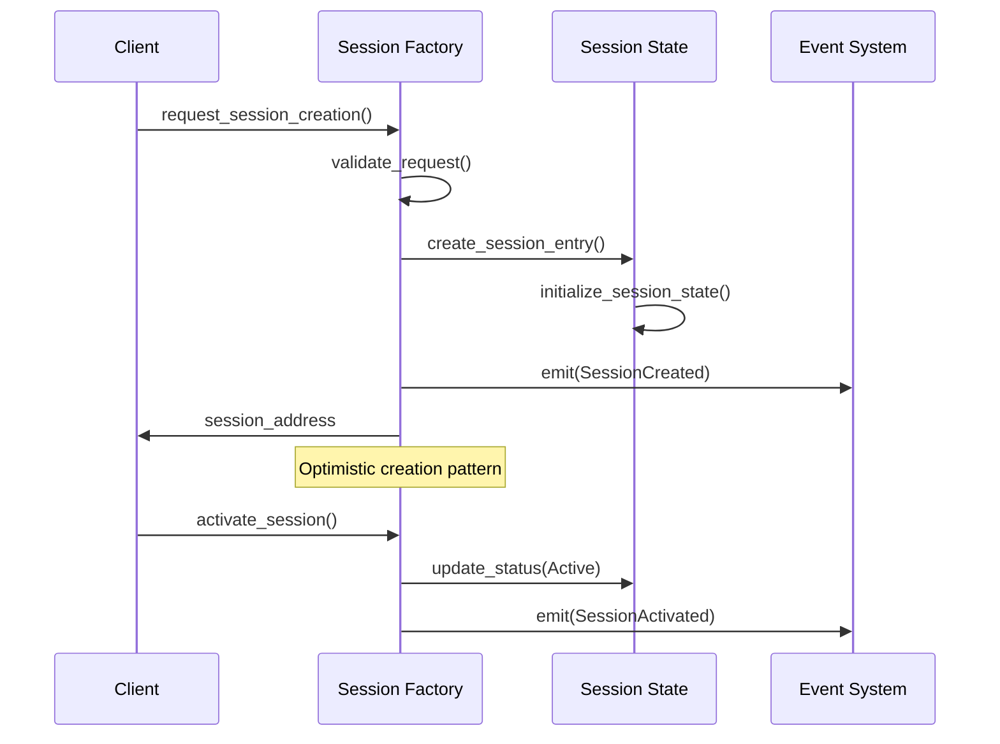

## Capability Execution Flow

### Primary Execution Path

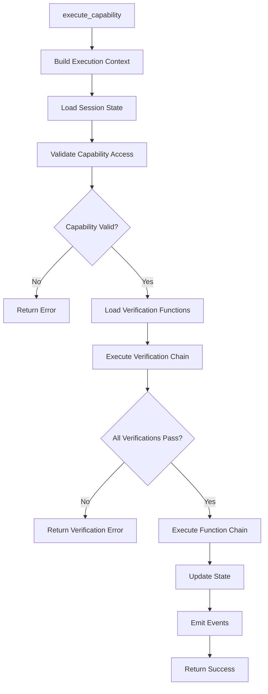

### Detailed Execution Sequence

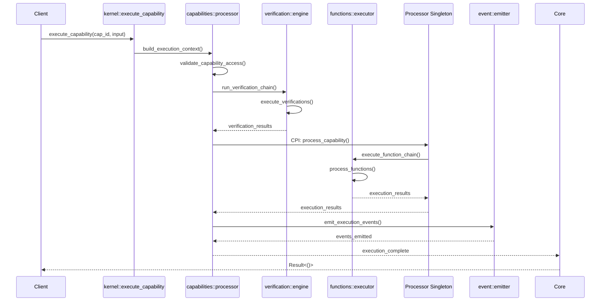

## Singleton Coordination Flow

### Multi-Shard Scheduling

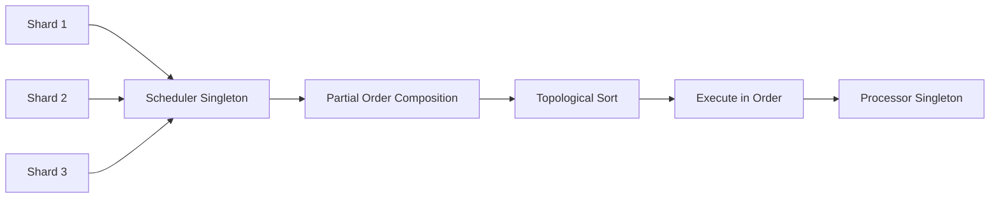

### Diff Processing Flow

## State Transitions

### Session State Lifecycle

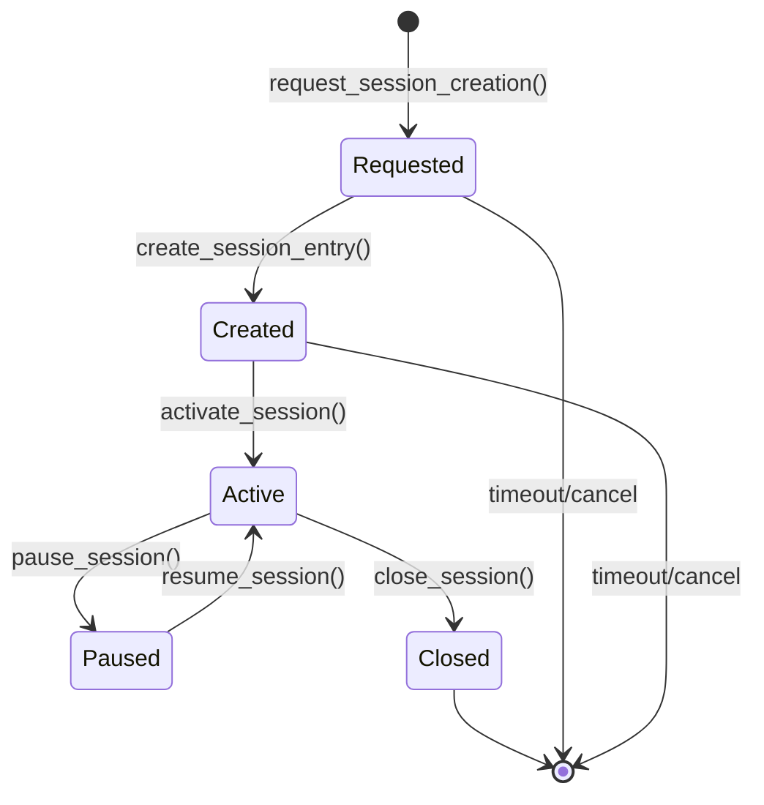

### Capability Execution States

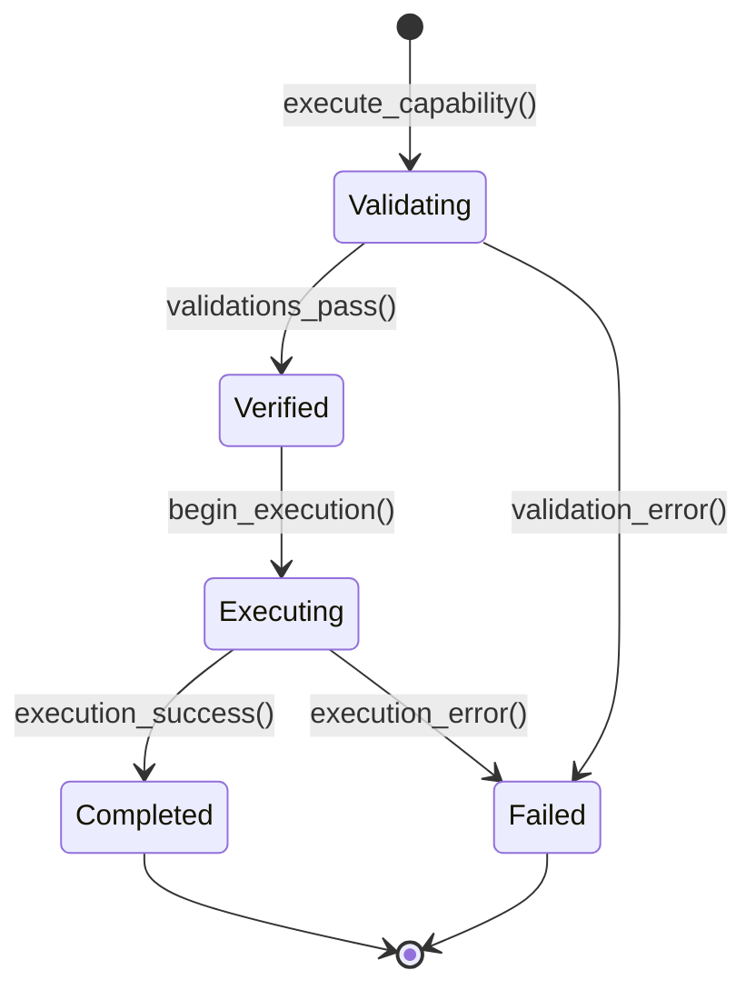

## Data Flow Patterns

### Context Building Pattern

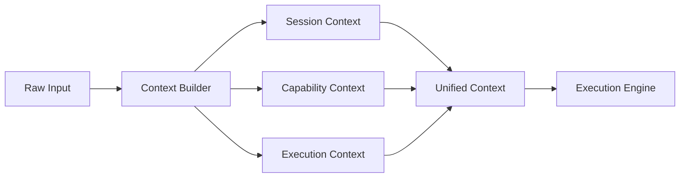

### Verification Chain Pattern

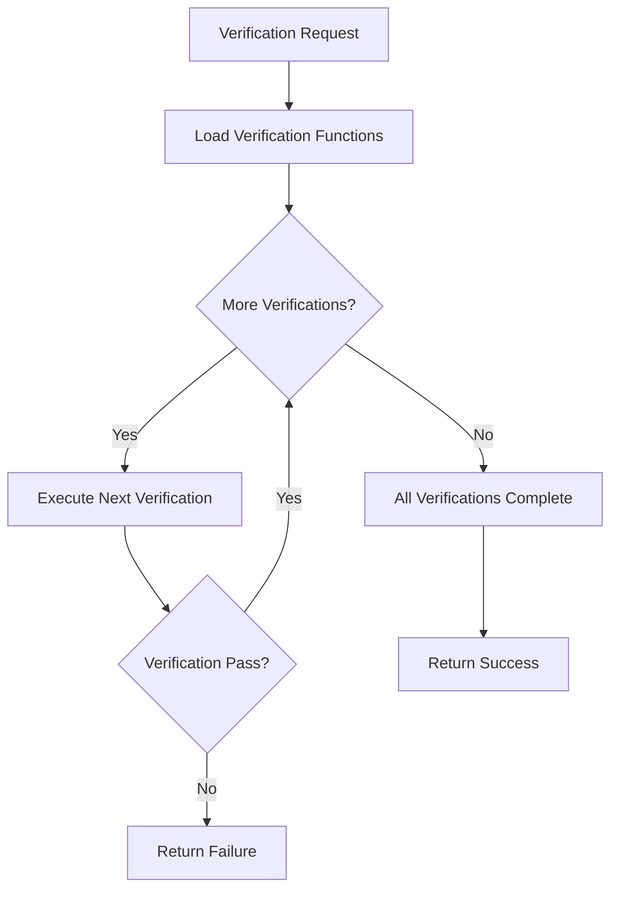

### Function Composition Pattern

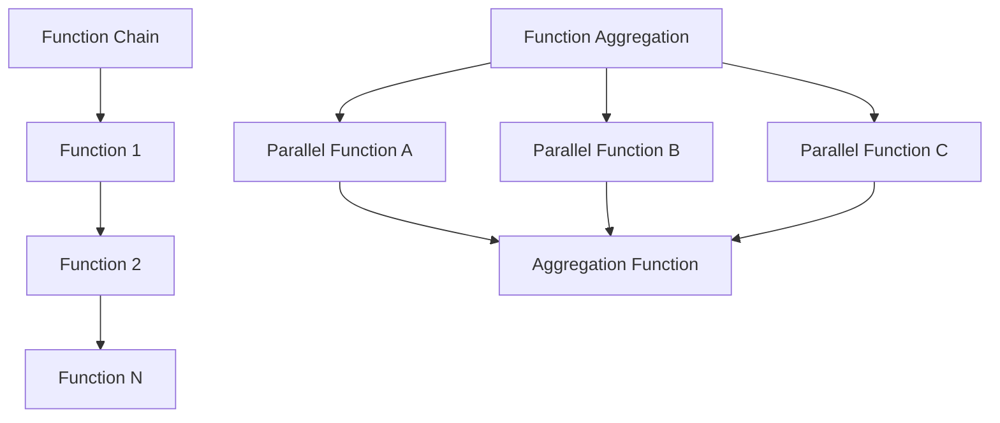

## Event Propagation

### Event Flow Architecture

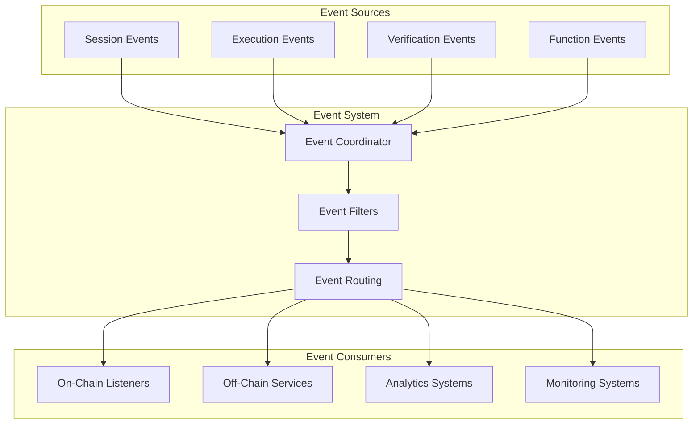

### Event Types & Timing

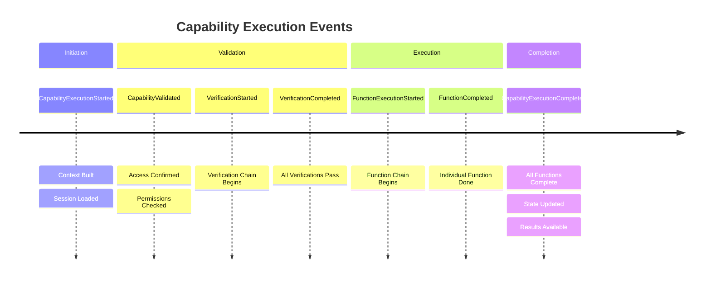

## Data Persistence Patterns

### Account State Management

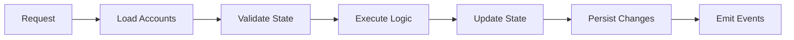

### Optimistic Update Pattern

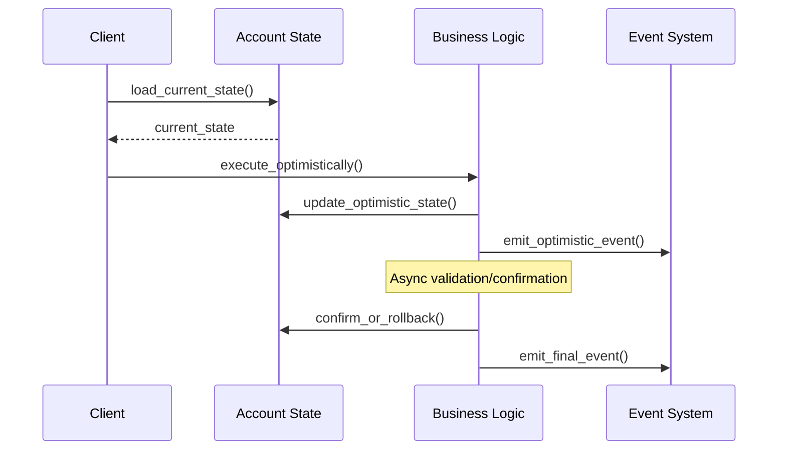

## Performance Considerations

### Efficient Data Access

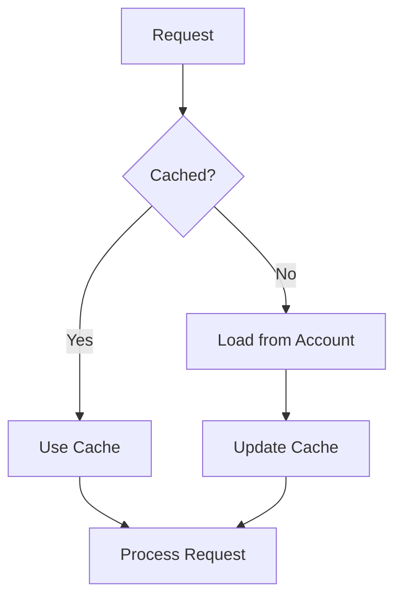

### Batch Processing Pattern

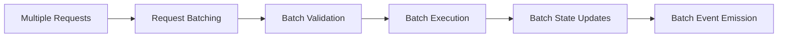

## Security in Data Flow

### Permission Validation Points

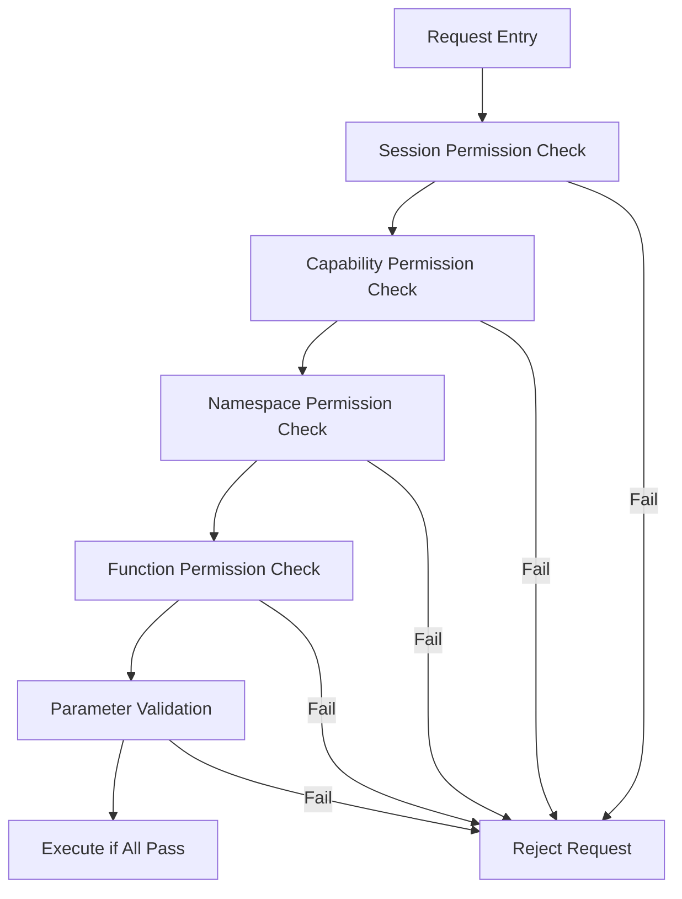

### Data Validation Flow

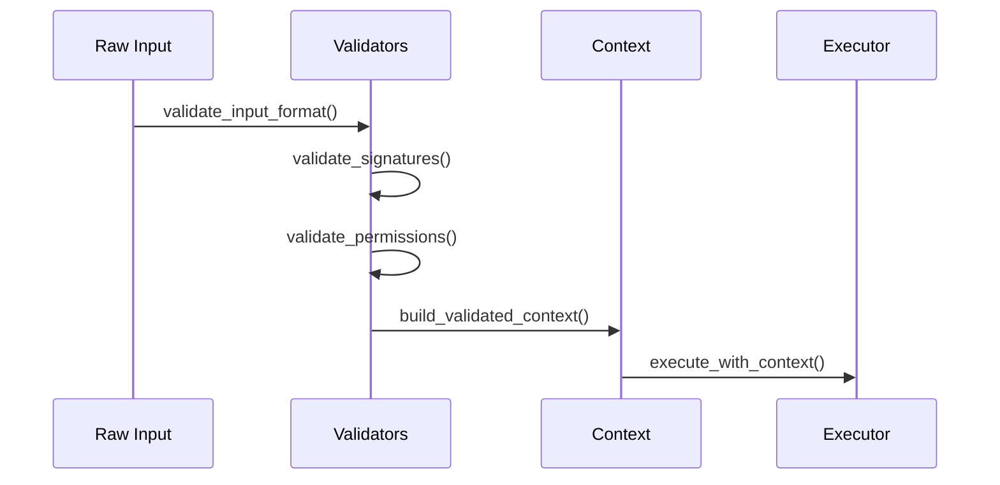