# System Data Flow

This document describes how data flows through the Valence Protocol system, from initial requests through execution completion.

## Request Lifecycle Overview

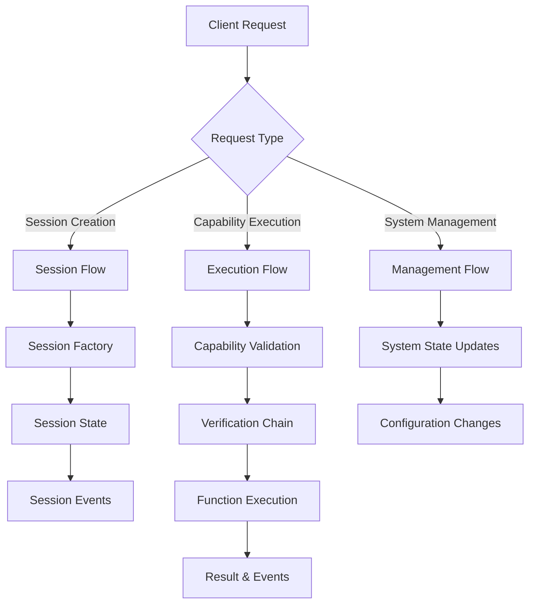

The Valence Protocol processes three main types of requests through distinct flows. Session requests go through the session factory to create session entries and emit events for off-chain services. Capability execution requests are validated against shard state, run through verification chains, and execute functions with result tracking. System management requests update configuration and pause/resume system components.

## Session Creation Flow

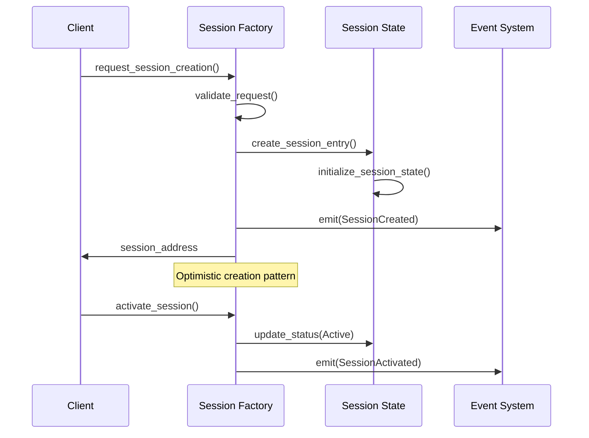

Session creation uses an optimistic pattern where the session factory immediately creates a session entry with a computed PDA, validates the request parameters, and emits events for off-chain services to handle the actual session program initialization. This provides immediate feedback to clients while deferring expensive operations.

## Capability Execution Flow

### Primary Execution Path

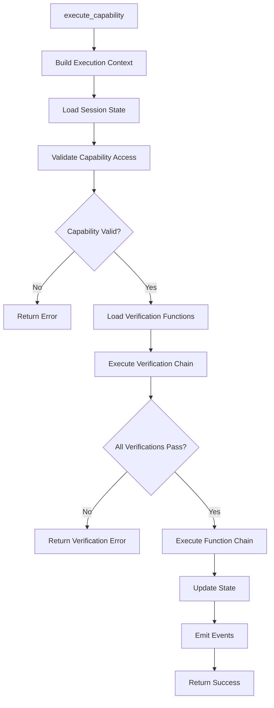

The capability execution flow follows a strict validation-then-execution pattern. The shard state processes the request using embedded eval logic, building an execution context, loading and validating session state, executing verification functions in sequence, and only proceeding to function execution if all verifications pass. State updates and event emission happen atomically.

### Detailed Execution Sequence

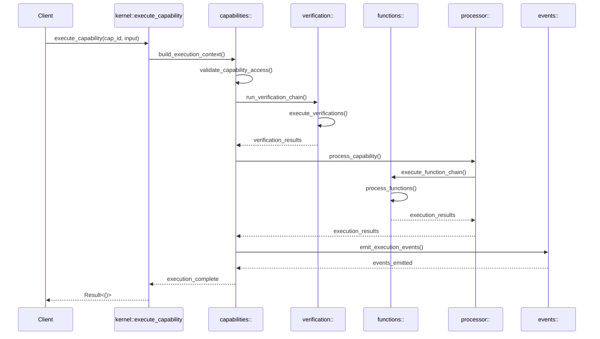

The detailed execution sequence shows how the kernel delegates to the capabilities module, which uses the processor singleton for stateless execution orchestration. The processor handles verification chain execution, function execution, and result aggregation. Events are emitted at key points to coordinate between modules and notify external systems.

## Singleton Module Coordination Flow

### Multi-Shard Scheduling

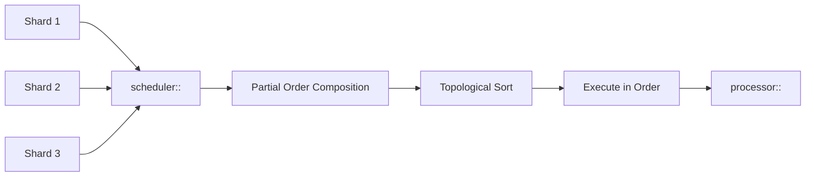

The scheduler singleton coordinates execution across multiple shards by collecting partial orders from each shard, composing them using dependency analysis, and performing topological sorting to determine execution order. This ensures capabilities with dependencies execute in the correct sequence while maximizing parallelism for independent operations.

### Diff Processing Flow

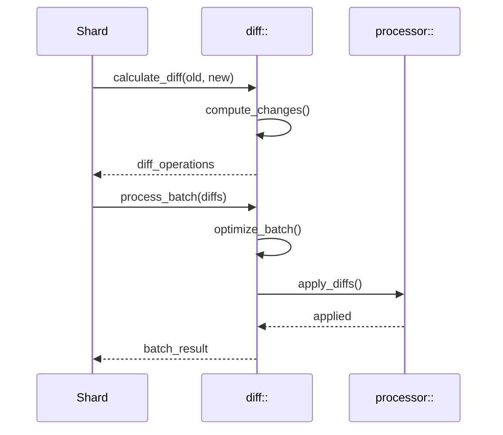

The diff module processes state changes by calculating differences between old and new state, optimizing batches of operations for efficiency, and applying changes atomically. This supports both key-value operations (Add/Update/Remove/Move) and positional operations (Insert/Delete/Replace) for different data structures.

## State Transitions

### Session State Lifecycle

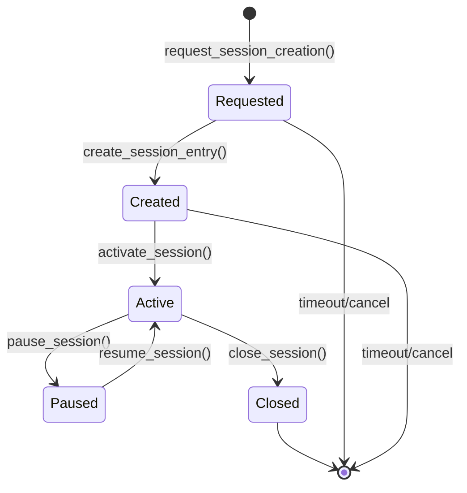

Session lifecycle management tracks sessions through discrete states from request to closure. The session factory creates entries optimistically in the "Requested" state, transitions to "Created" when the session program initializes the account, and becomes "Active" when fully operational. Sessions can be paused and resumed as needed, with proper cleanup when closed.

### Capability Execution States

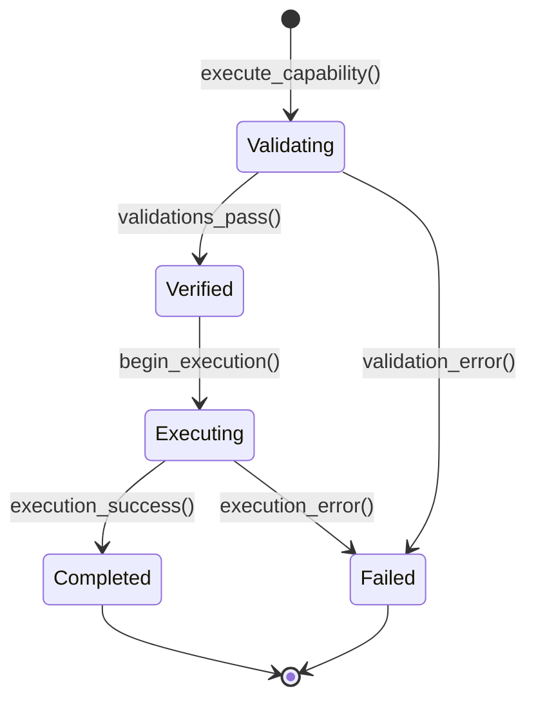

Capability execution follows a strict state machine where validation must complete successfully before execution begins. The shard state tracks execution counters and applies eval rules to ensure compliance with configured limits and constraints. Failed executions are logged for debugging and monitoring.

## Data Flow Patterns

### Context Building Pattern

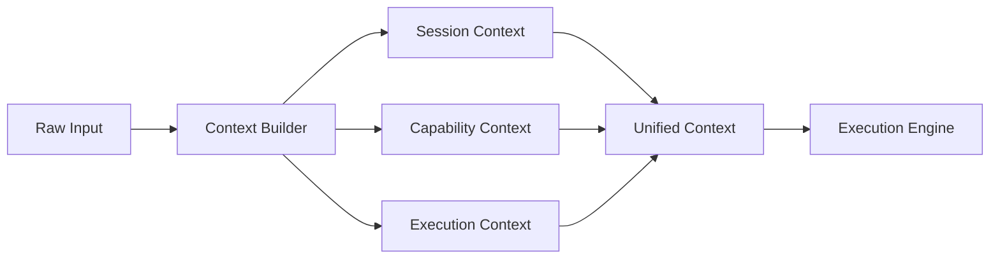

The context builder pattern consolidates information from multiple sources into a unified execution context. This includes session state, capability definitions, and execution parameters. The context builder validates inputs, resolves dependencies, and creates an immutable context object passed through the execution pipeline.

### Verification Chain Pattern

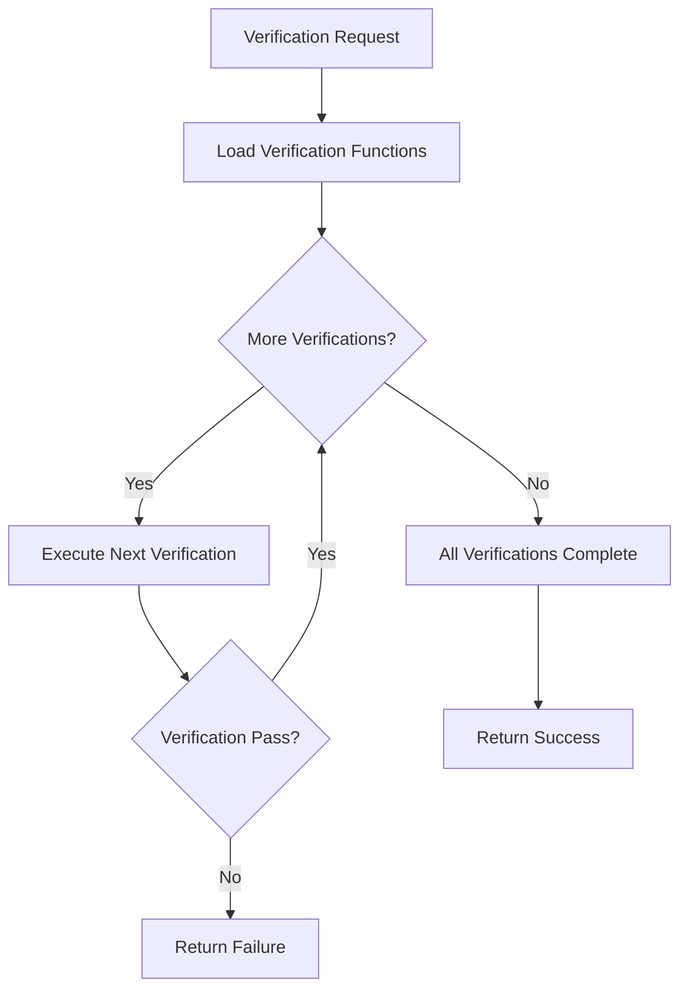

The verification chain executes a sequence of pure verification functions, each returning a boolean result. The chain stops immediately on the first failure, providing fast feedback. Verification functions are loaded by hash from the registry and executed with the current execution context and parameters.

### Function Composition Pattern

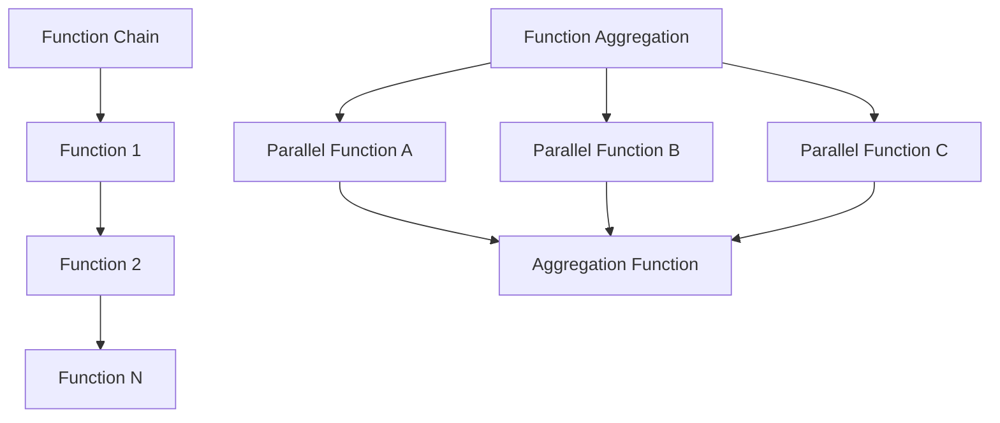

Function composition supports both sequential chains and parallel aggregations. Chains execute functions in order, passing output from one function as input to the next. Aggregations execute functions in parallel and combine results using configurable aggregation strategies (merge, vote, consensus).

## Event Propagation

### Event Flow Architecture

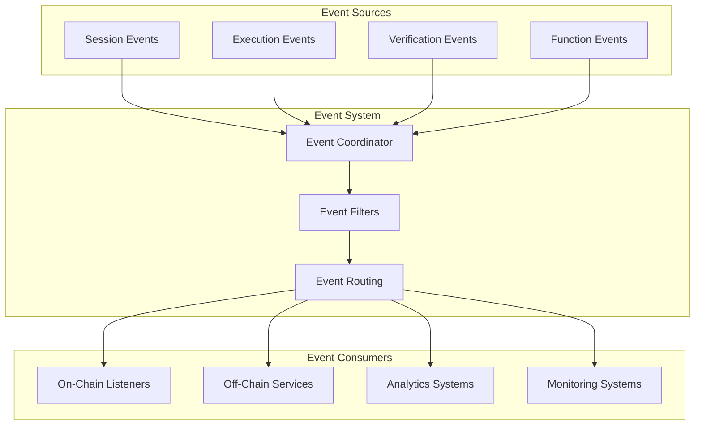

The event system coordinates communication between modules and external systems. Events are emitted from various sources, processed through filters and routing logic, and delivered to registered consumers. This enables loose coupling between components and supports real-time monitoring and analytics.

### Event Types & Timing

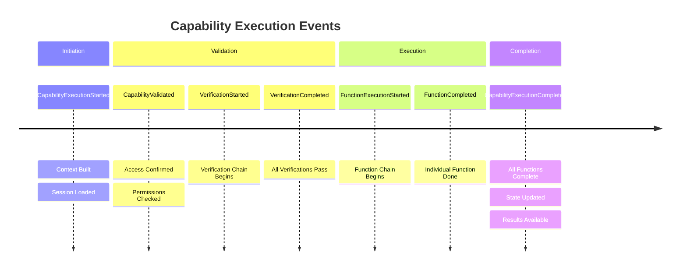

Event timing follows the execution lifecycle, providing visibility into each stage of capability processing. Events include detailed context about the operation, timing information, and success/failure status. This enables comprehensive monitoring and debugging of system behavior.

## Data Persistence Patterns

### Account State Management

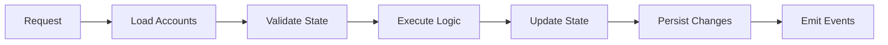

Account state management follows Solana's ownership model where programs own and modify their account data. The system loads relevant accounts, validates current state, executes business logic, updates state atomically, and emits events. Account constraints ensure data integrity and prevent unauthorized modifications.

### Optimistic Update Pattern

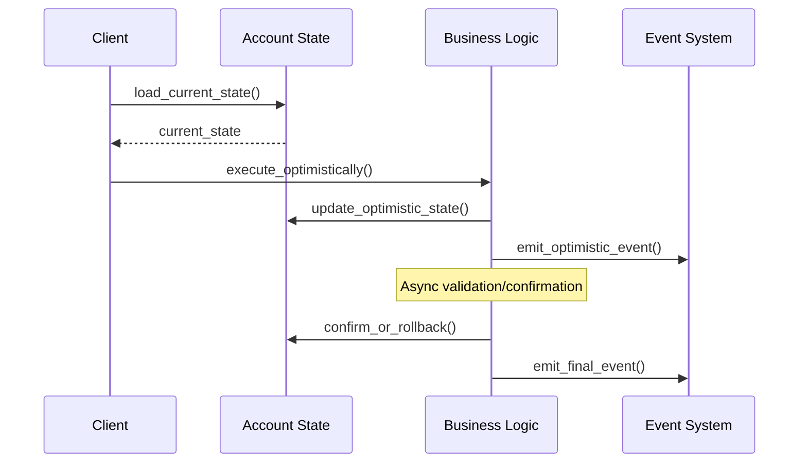

The optimistic update pattern provides immediate feedback to clients while deferring expensive operations. Used primarily in session creation, the system creates entries immediately with "pending" status, emits events for off-chain processing, and later confirms or rolls back the operation based on validation results.

## Performance Considerations

### Efficient Data Access

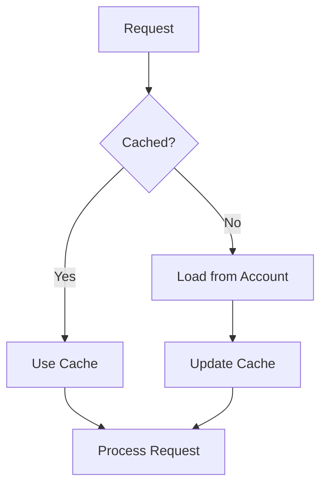

Performance optimization uses caching strategies for frequently accessed data like function definitions, verification results, and session state. Cache keys are constructed from relevant parameters, with LRU eviction policies to manage memory usage. Cache hits provide significant performance improvements for repeated operations.

### Batch Processing Pattern

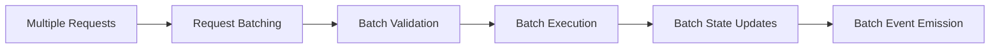

Batch processing improves throughput by grouping related operations and processing them together. The scheduler singleton coordinates batching across shards, while the diff module optimizes state changes. Batching reduces transaction costs and improves resource utilization.

## Security in Data Flow

### Permission Validation Points

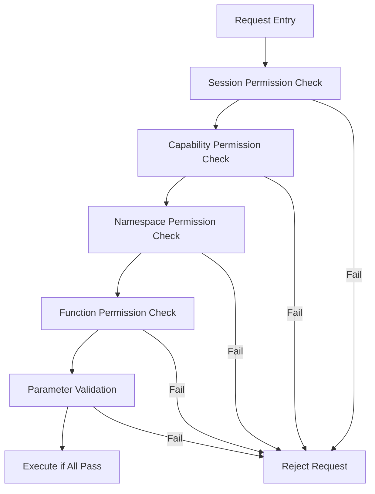

Security validation occurs at multiple layers with fail-fast behavior. Each validation point checks specific permissions and constraints, immediately rejecting requests that don't meet requirements. This defense-in-depth approach ensures comprehensive security coverage throughout the execution flow.

### Data Validation Flow

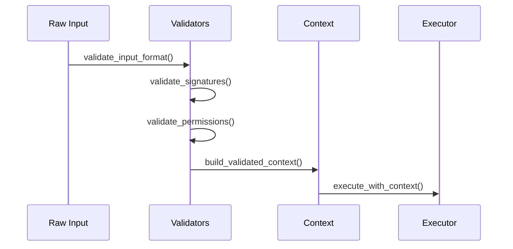

Data validation follows a strict pipeline where input format is validated first, followed by cryptographic signature verification, permission checking, and context building. Only validated data proceeds to execution, ensuring system integrity and preventing malicious or malformed inputs from affecting system state. 