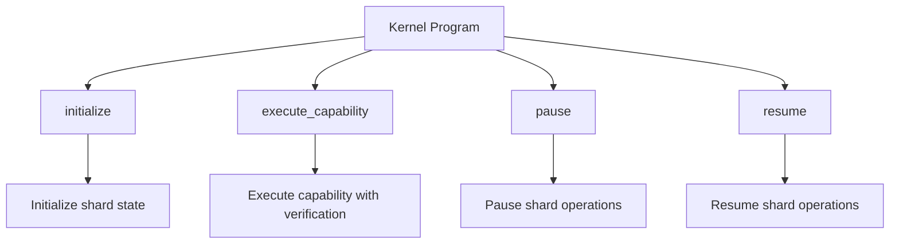

# API Reference

Complete reference for the Valence Protocol kernel program instructions, accounts, and data structures.

## Program Instructions

### Kernel Program Instructions



#### initialize
Initializes the kernel shard with eval capabilities.

**Signature:**
```rust
pub fn initialize(
    ctx: Context<Initialize>,
    processor_program: Pubkey
) -> Result<()>
```

**Accounts:**
```rust
#[derive(Accounts)]
pub struct Initialize<'info> {
    #[account(
        init,
        payer = authority,
        space = ShardState::SPACE,
        seeds = [b"shard_state"],
        bump
    )]
    pub shard_state: Account<'info, ShardState>,
    
    #[account(mut)]
    pub authority: Signer<'info>,
    
    pub system_program: Program<'info, System>,
}
```

**Parameters:**
- `processor_program: Pubkey` - Address of the processor program

**Returns:** `Result<()>`

#### execute_capability
Executes a capability with full verification chain.

**Signature:**
```rust
pub fn execute_capability(
    ctx: Context<ExecuteCapability>,
    capability_definition: CapabilityDefinition,
    input_data: Vec<u8>
) -> Result<()>
```

**Accounts:**
```rust
#[derive(Accounts)]
pub struct ExecuteCapability<'info> {
    #[account(mut)]
    pub shard_state: Account<'info, ShardState>,
    
    /// CHECK: Session account - verified by capability verification
    pub session: AccountInfo<'info>,
    
    #[account(mut)]
    pub executor: Signer<'info>,
}
```

**Parameters:**
- `capability_definition: CapabilityDefinition` - Definition of the capability to execute
- `input_data: Vec<u8>` - Serialized input data for the capability

**Returns:** `Result<()>`

#### pause
Pauses shard operations.

**Signature:**
```rust
pub fn pause(ctx: Context<Pause>) -> Result<()>
```

**Accounts:**
```rust
#[derive(Accounts)]
pub struct Pause<'info> {
    #[account(
        mut,
        has_one = authority,
        seeds = [b"shard_state"],
        bump = shard_state.bump
    )]
    pub shard_state: Account<'info, ShardState>,
    
    pub authority: Signer<'info>,
}
```

**Parameters:** None

**Returns:** `Result<()>`

#### resume
Resumes shard operations.

**Signature:**
```rust
pub fn resume(ctx: Context<Resume>) -> Result<()>
```

**Accounts:**
```rust
#[derive(Accounts)]
pub struct Resume<'info> {
    #[account(
        mut,
        has_one = authority,
        seeds = [b"shard_state"],
        bump = shard_state.bump
    )]
    pub shard_state: Account<'info, ShardState>,
    
    pub authority: Signer<'info>,
}
```

**Parameters:** None

**Returns:** `Result<()>`

## Account Structures

### ShardState
Main shard state account with embedded evaluation configuration.

```rust
#[account]
pub struct ShardState {
    /// Authority that can manage the shard
    pub authority: Pubkey,
    
    /// Processor program that handles execution
    pub processor_program: Pubkey,
    
    /// Whether the shard is paused
    pub is_paused: bool,
    
    /// Total number of capabilities executed
    pub total_executions: u64,
    
    /// Shard version
    pub version: u8,
    
    /// PDA bump seed
    pub bump: u8,
    
    /// Evaluation configuration
    pub eval_config: EvalConfig,
}
```

### EvalConfig
Evaluation configuration embedded in shard.

```rust
#[derive(AnchorSerialize, AnchorDeserialize, Clone, Debug, Default)]
pub struct EvalConfig {
    /// Maximum execution time allowed (seconds)
    pub max_execution_time: u64,
    
    /// Maximum compute units allowed
    pub max_compute_units: u64,
    
    /// Whether to record execution results
    pub record_execution: bool,
    
    /// Default verification function requirements
    pub default_verification_functions: Vec<[u8; 32]>,
}
```

### SessionState
Session configuration and state.

```rust
#[account]
pub struct SessionState {
    /// Session configuration
    pub config: SessionConfiguration,
    
    /// Current session status
    pub status: SessionStatus,
    
    /// Session permissions
    pub permissions: SessionPermissions,
    
    /// Session creation timestamp
    pub created_at: i64,
    
    /// Session expiration timestamp
    pub expires_at: i64,
    
    /// Usage statistics
    pub usage_stats: SessionUsageStats,
}
```

### LibraryEntry
Function library registry entry.

```rust
#[derive(AnchorSerialize, AnchorDeserialize, Clone, Debug)]
pub struct LibraryEntry {
    /// Library name
    pub name: String,
    
    /// Library version
    pub version: String,
    
    /// Library program ID
    pub program_id: Pubkey,
    
    /// Library status
    pub status: LibraryStatus,
    
    /// Supported function types
    pub function_types: Vec<String>,
    
    /// Library dependencies
    pub dependencies: Vec<String>,
    
    /// Registration timestamp
    pub registered_at: i64,
}
```

## Data Structures

### Session Configuration

```rust
#[derive(AnchorSerialize, AnchorDeserialize, Clone, Debug)]
pub struct SessionConfiguration {
    /// Maximum session duration in seconds
    pub max_duration: u64,
    
    /// Session permissions
    pub permissions: SessionPermissions,
    
    /// Session settings
    pub settings: SessionSettings,
}
```

### Session Permissions

```rust
#[derive(AnchorSerialize, AnchorDeserialize, Clone, Debug)]
pub struct SessionPermissions {
    /// Can execute functions
    pub can_execute_functions: bool,
    
    /// Can compose functions
    pub can_compose_functions: bool,
    
    /// Can read cross-session data
    pub can_read_cross_session: bool,
    
    /// Can write cross-session data
    pub can_write_cross_session: bool,
}
```

### Capability Definition

```rust
#[derive(AnchorSerialize, AnchorDeserialize, Clone, Debug)]
pub struct CapabilityDefinition {
    /// Capability identifier
    pub id: String,
    
    /// Capability type
    pub capability_type: CapabilityType,
    
    /// Capability scope
    pub scope: CapabilityScope,
    
    /// Required permissions
    pub required_permissions: Vec<String>,
    
    /// Associated functions
    pub functions: Vec<String>,
    
    /// Namespace restrictions
    pub namespace_restrictions: Vec<String>,
}
```

### Execution Context

```rust
#[derive(Debug, Clone)]
pub struct ExecutionContext {
    /// Capability being executed
    pub capability_id: String,
    
    /// Session identifier
    pub session_id: String,
    
    /// Session account (optional)
    pub session: Option<Pubkey>,
    
    /// Caller pubkey
    pub caller: Pubkey,
    
    /// Current block height
    pub block_height: u64,
    
    /// Current timestamp
    pub timestamp: i64,
    
    /// Remaining compute budget
    pub remaining_compute: u32,
    
    /// Input data for execution
    pub input_data: Vec<u8>,
}
```

## Function Types

### Verification Functions

```rust
#[derive(AnchorSerialize, AnchorDeserialize, Clone, Debug)]
pub struct VerificationInput {
    /// Verification context
    pub context: ExecutionContext,
    
    /// Verification parameters
    pub parameters: Vec<u8>,
    
    /// Additional verification data
    pub verification_data: Vec<u8>,
}

#[derive(AnchorSerialize, AnchorDeserialize, Clone, Debug)]
pub struct VerificationOutput {
    /// Verification result
    pub success: bool,
    
    /// Verification details
    pub details: String,
    
    /// Additional output data
    pub output_data: Vec<u8>,
}
```

### Function Composition

```rust
#[derive(AnchorSerialize, AnchorDeserialize, Clone, Debug)]
pub struct FunctionChain {
    /// Chain identifier
    pub id: String,
    
    /// Function steps in order
    pub steps: Vec<FunctionStep>,
    
    /// Execution mode
    pub execution_mode: ExecutionMode,
}

#[derive(AnchorSerialize, AnchorDeserialize, Clone, Debug)]
pub struct FunctionStep {
    /// Function identifier
    pub function_id: String,
    
    /// Input mapping
    pub input_mapping: Vec<(String, String)>,
    
    /// Output mapping
    pub output_mapping: Vec<(String, String)>,
    
    /// Conditional execution
    pub condition: Option<String>,
}
```

## Error Types

### Registry Errors

```rust
#[error_code]
pub enum RegistryError {
    #[msg("Library not found")]
    LibraryNotFound,
    
    #[msg("Invalid library version")]
    InvalidVersion,
    
    #[msg("Dependency not satisfied")]
    DependencyNotSatisfied,
    
    #[msg("System is paused")]
    SystemPaused,
    
    #[msg("Unauthorized access")]
    Unauthorized,
}
```

### Verification Errors

```rust
#[error_code]
pub enum VerificationError {
    #[msg("Verification failed")]
    VerificationFailed,
    
    #[msg("Invalid verification input")]
    InvalidInput,
    
    #[msg("Verification timeout")]
    Timeout,
    
    #[msg("Unknown verification function")]
    UnknownFunction,
    
    #[msg("Permission denied")]
    PermissionDenied,
}
```

## Event Types

### Session Events

```rust
#[event]
pub struct SessionCreated {
    pub session_id: String,
    pub session_address: Pubkey,
    pub creator: Pubkey,
    pub configuration: SessionConfiguration,
}

#[event]
pub struct SessionActivated {
    pub session_id: String,
    pub session_address: Pubkey,
    pub activated_at: i64,
}

#[event]
pub struct SessionClosed {
    pub session_id: String,
    pub session_address: Pubkey,
    pub closed_at: i64,
    pub reason: String,
}
```

### Execution Events

```rust
#[event]
pub struct CapabilityExecutionStarted {
    pub capability_id: String,
    pub session_id: String,
    pub caller: Pubkey,
    pub started_at: i64,
}

#[event]
pub struct CapabilityExecutionCompleted {
    pub capability_id: String,
    pub session_id: String,
    pub caller: Pubkey,
    pub completed_at: i64,
    pub success: bool,
}

#[event]
pub struct VerificationCompleted {
    pub capability_id: String,
    pub verification_functions: Vec<String>,
    pub results: Vec<bool>,
    pub completed_at: i64,
}
```

## Usage Examples

### Initialize System

```rust
// Initialize the kernel protocol
let ctx = Context::new(
    program_id,
    &mut accounts,
    &[],
    BumpSeed::default(),
);

kernel::initialize(ctx)?;
```

### Execute Capability

```rust
// Execute a capability with verification
let capability_id = "example_capability".to_string();
let input_data = vec![1, 2, 3, 4]; // Serialized input

let ctx = Context::new(
    program_id,
    &mut accounts,
    &[],
    BumpSeed::default(),
);

kernel::execute_capability(ctx, capability_id, input_data)?;
```

### Build Execution Context

```rust
// Build execution context for capability
let context = ContextBuilder::new()
    .with_capability_id("example_capability".to_string())
    .with_session(session_pubkey)
    .with_caller(caller_pubkey)
    .with_input_data(input_data)
    .build()?;
```

## Query Patterns

### Session Queries

```rust
// Load session state
let session_account = &ctx.accounts.session;
let session_state = session_account.load()?;

// Check session permissions
if session_state.permissions.can_execute_functions {
    // Execute function
}
```

### Registry Queries

```rust
// Query available libraries
let registry = &ctx.accounts.registry;
let libraries = &registry.libraries;

// Find library by name
let library = libraries.iter()
    .find(|lib| lib.name == "example_library")
    .ok_or(RegistryError::LibraryNotFound)?;
```

## Singleton Modules

### processor:: Module

Handles stateless execution orchestration within the kernel.

**Key Components:**
- `execution_engine`: Core execution logic
- `verification_orchestrator`: Manages verification chains
- `context_builder`: Builds execution contexts
- `state`: Processor state management

**Main Types:**
```rust
pub struct ExecutionContext {
    /// Capability being executed
    pub capability_id: String,
    /// Session identifier
    pub session_id: String,
    /// Session account (optional)
    pub session: Option<Pubkey>,
    /// Caller pubkey
    pub caller: Pubkey,
    /// Current block height
    pub block_height: u64,
    /// Current timestamp
    pub timestamp: i64,
    /// Remaining compute budget
    pub remaining_compute: u32,
    /// Input data for execution
    pub input_data: Vec<u8>,
}

pub struct ExecutionResult {
    /// Whether execution succeeded
    pub success: bool,
    /// Result data
    pub result_data: Vec<u8>,
    /// Gas consumed
    pub gas_consumed: u32,
    /// Execution logs
    pub logs: Vec<String>,
}
```

### scheduler:: Module

Manages multi-shard scheduling and queue management within the kernel.

**Key Components:**
- `partial_order_composer`: Composes partial orders from constraints
- `queue_manager`: Manages execution queues
- `priority_scheduler`: Priority-based scheduling
- `state`: Scheduler state management

**Main Types:**
```rust
pub struct SchedulerState {
    pub authority: Pubkey,
    pub is_paused: bool,
    pub max_shards: u16,
    pub max_queue_size: u16,
    pub active_shards: u16,
    pub queue_depth: u16,
    pub total_scheduled: u64,
    pub total_processed: u64,
    pub bump: u8,
}

pub struct PartialOrder {
    /// Unique identifier for this partial order
    pub id: String,
    /// List of ordering constraints
    pub constraints: Vec<OrderingConstraint>,
    /// Priority level
    pub priority: u8,
}
```

### diff:: Module

Calculates and optimizes state diffs within the kernel.

**Key Components:**
- `diff_calculator`: Calculates state differences
- `batch_processor`: Processes diff batches
- `optimizer`: Optimizes diff operations
- `state`: Diff state management

**Main Types:**
```rust
pub struct DiffState {
    pub authority: Pubkey,
    pub is_paused: bool,
    pub max_batch_size: u16,
    pub optimization_level: OptimizationLevel,
    pub total_diffs_processed: u64,
    pub total_batches_optimized: u64,
    pub bump: u8,
}

pub enum OptimizationLevel {
    None,
    Basic,
    Advanced,
}
``` 