# Integration Patterns

How modules integrate and work together in the Valence Protocol hosted microkernel architecture.

## Integration Overview

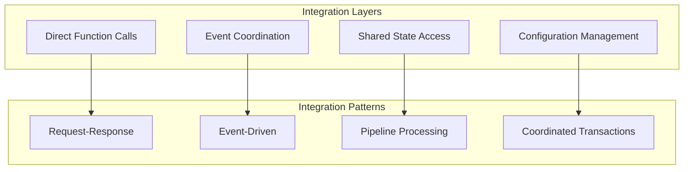

## Core Integration Patterns

### Request-Response Pattern

Direct module interactions provide immediate responses between components. This pattern enables one module to call another with parameters and receive response data directly.

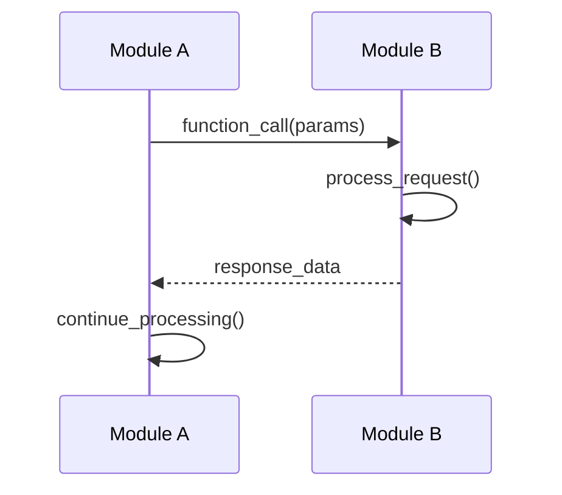

Capability validation during execution demonstrates this pattern where the capabilities:: module validates access before calling the processor:: module for execution.

### Event-Driven Pattern

Event-driven coordination enables loose coupling and handles cross-cutting concerns through an event system that distributes notifications to multiple handlers.

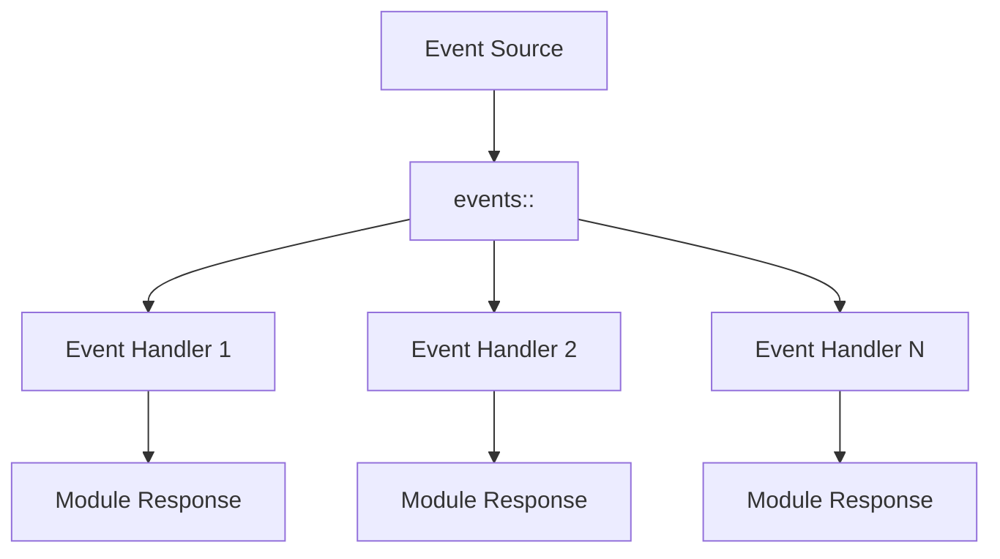

Session lifecycle events illustrate this pattern where the sessions:: module emits events that other modules listen for to update their relevant state.

### Pipeline Processing Pattern

Sequential data transformation flows through multiple modules where each stage processes the data and passes it to the next stage, often sharing state along the way.

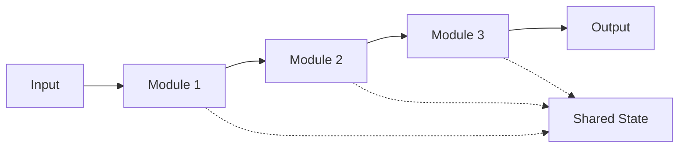

Capability execution demonstrates this pipeline where data flows through context preparation, verification, and function execution stages.

### Coordinated Transaction Pattern

Multi-module operations that must succeed or fail together use coordination to ensure consistency across module boundaries.

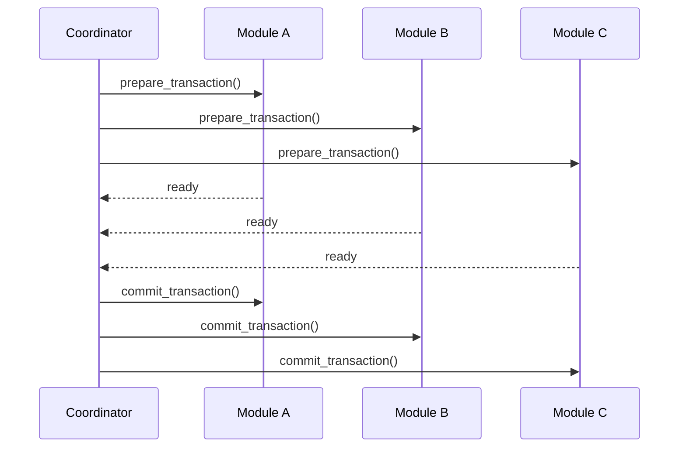

Session creation with multiple state updates exemplifies this pattern where session state, capability bindings, and function registry must all be prepared before committing the transaction.

## Module Integration Patterns

### Capabilities and Sessions Integration

The capabilities:: module integrates with sessions:: by loading session state, validating permissions, executing with session context, and updating usage statistics. The sessions:: module creates sessions, emits events, and provides context for capability operations.

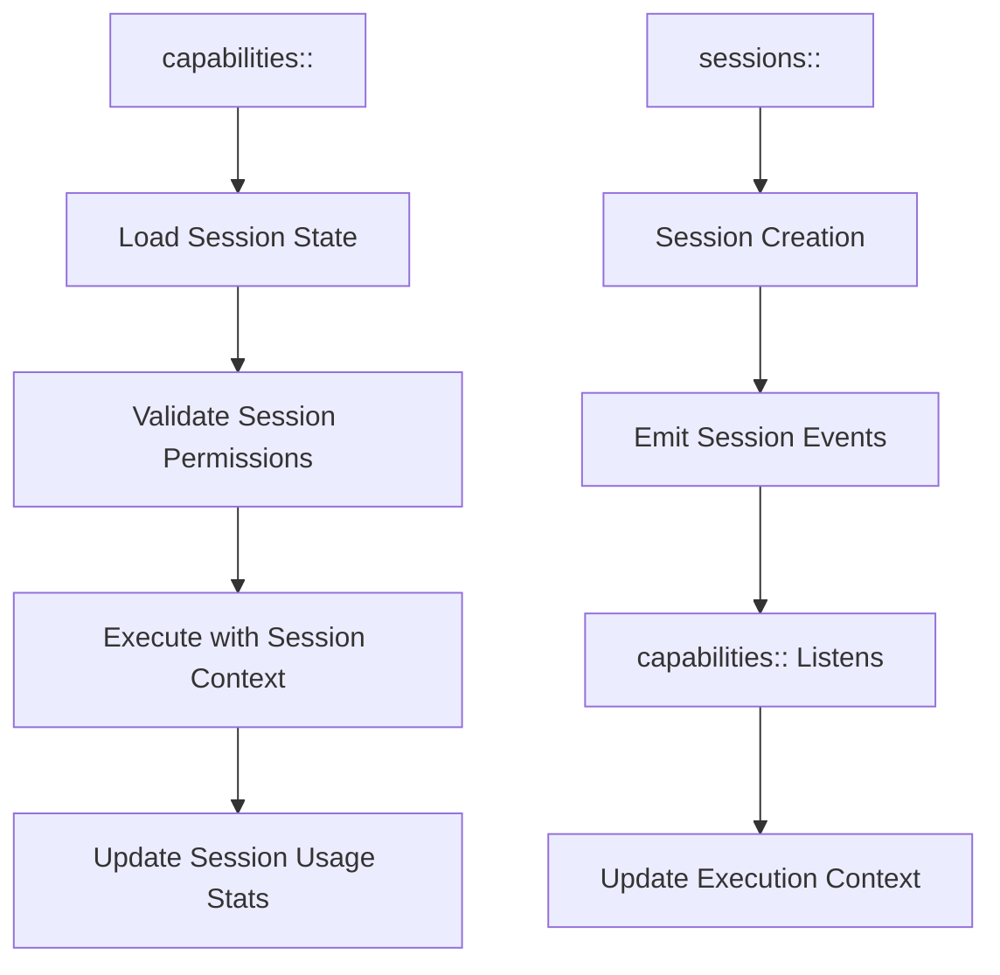

The capabilities:: module accesses session state directly, validates permissions, builds execution context with session data, and executes capabilities within the session context.

### Capabilities and Verification Integration

Capabilities:: module requests verification from the verification:: module, which loads and executes verification functions, then aggregates results for capability validation.

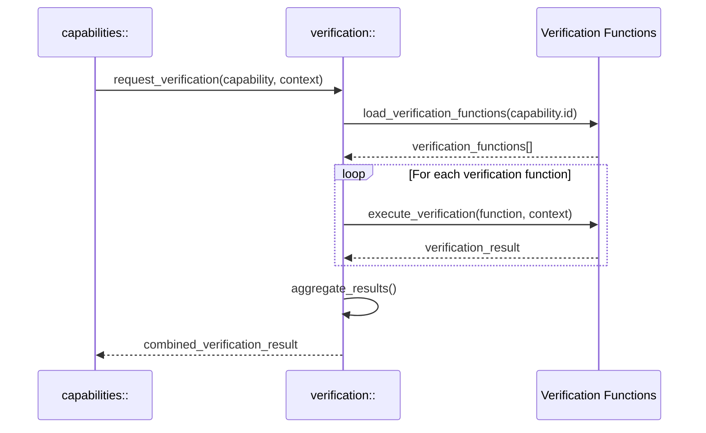

The capabilities:: module gets required verifications, executes the verification chain, validates namespace access, and combines results for comprehensive capability validation.

### Functions and Verification Integration

Functions integrate with verification by loading function definitions, getting required verifications, executing verification chains, and proceeding with function execution only after verification passes.

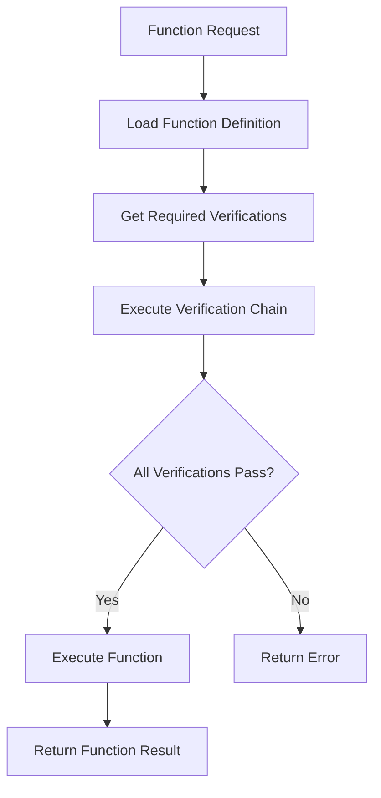

The function executor loads function definitions, creates verification input with context and parameters, runs verification chains, and executes functions only after successful verification.

## Cross-Module State Management

### Shared State Access Pattern

Modules access shared state through well-defined interfaces across session state, registry state, execution state, and configuration state.

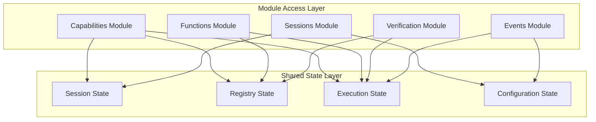

State access is implemented through traits that provide consistent interfaces for loading registry state, session state, execution state, and configuration across all modules.

### State Consistency Patterns

State consistency is maintained through transaction coordination where modules begin transactions, update state, notify other modules of changes, validate changes, and commit transactions with proper coordination.

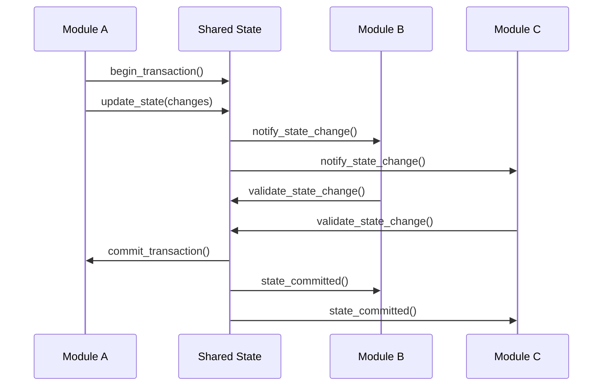

## Event Coordination Patterns

### Event-Driven Module Coordination

Event coordination flows from event sources through an event bus and router to multiple module handlers that process events and emit response events.

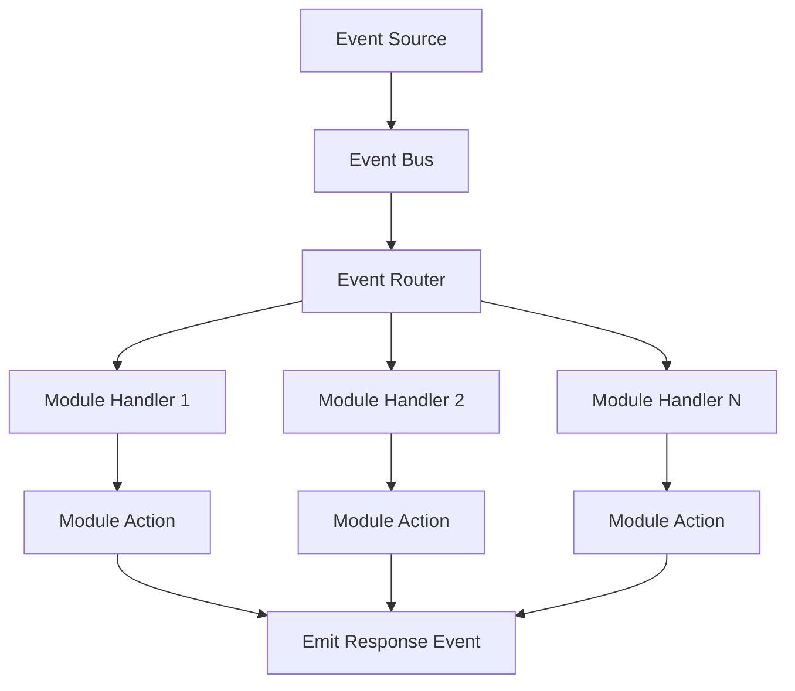

Event coordination systems maintain handler registries, emit events to appropriate handlers, and enable module event handler implementations that respond to specific event types by updating relevant state.

## Performance Integration Patterns

### Optimized Call Patterns

High-frequency calls are optimized through caching where cached results are returned immediately while uncached calls execute module operations and update the cache.

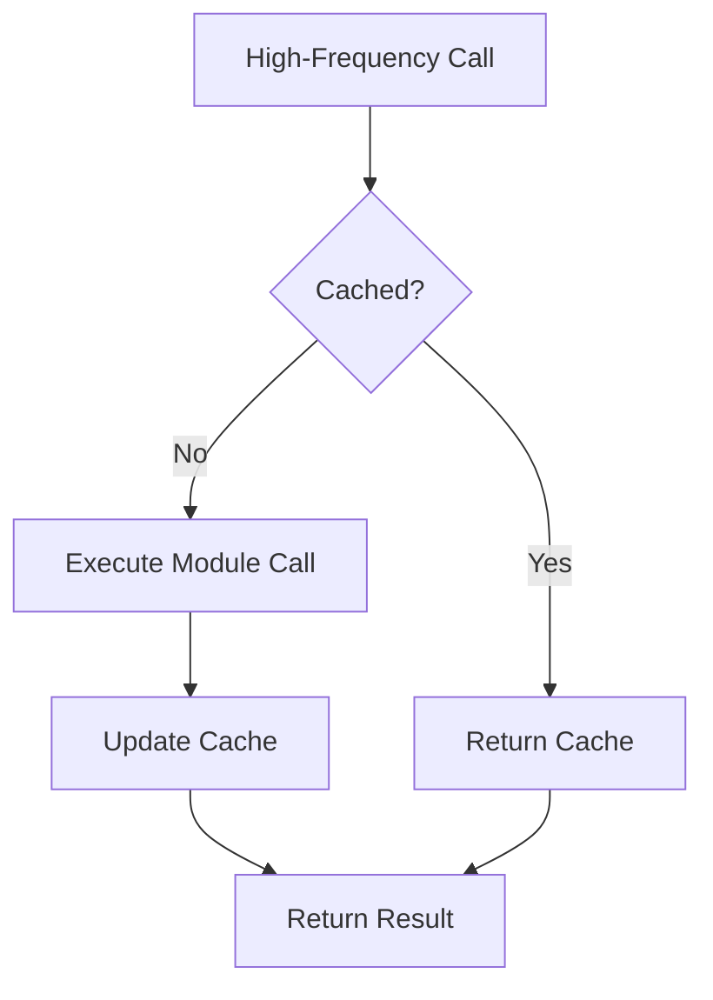

Performance-optimized integration uses caches, metrics tracking, and efficient operation execution to minimize overhead in high-frequency module interactions.

### Batch Processing Integration

Batch processing coordinates multiple requests through request batching, batch validation, batch execution, batch state updates, and batch event emission to improve overall system throughput.

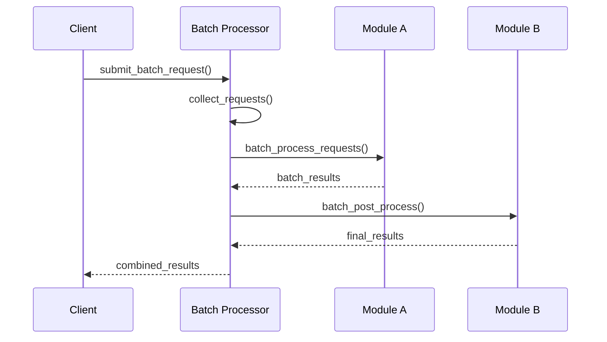

Batch processors group requests by module, process module batches efficiently, and return combined results to improve performance for multiple related operations.

## Security Integration Patterns

### Permission Chain Validation

Security integration validates permissions through session permission checks, capability permission checks, function permission checks, namespace permission checks, and parameter validation before allowing execution.

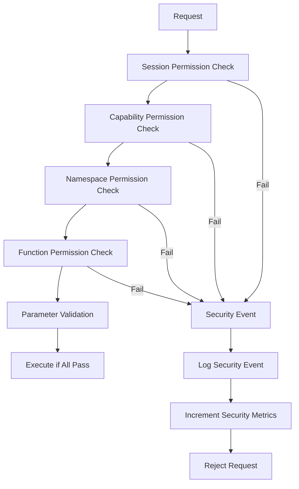

Security integration maintains permission chains, logs security events, tracks security metrics, and rejects requests that fail any validation step in the security chain. 