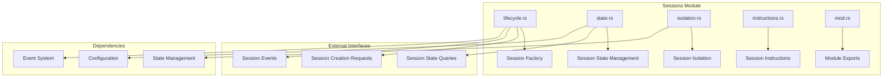
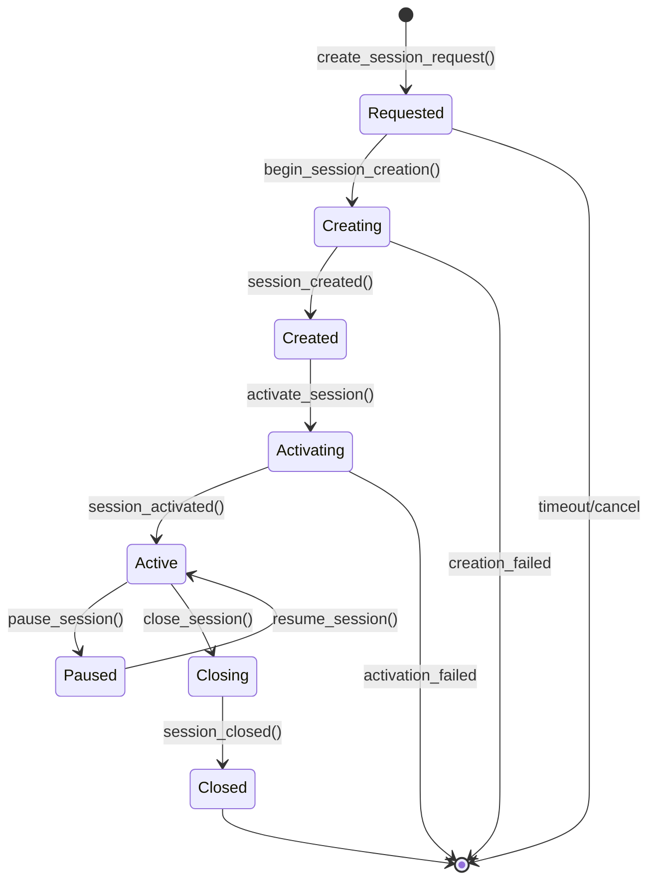
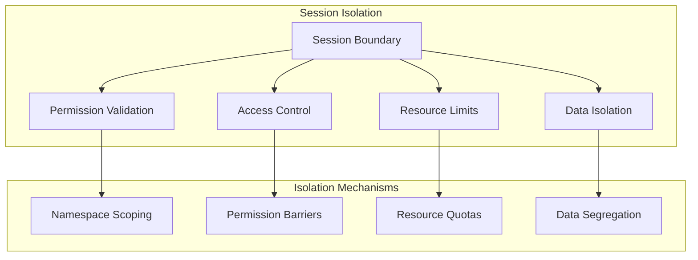
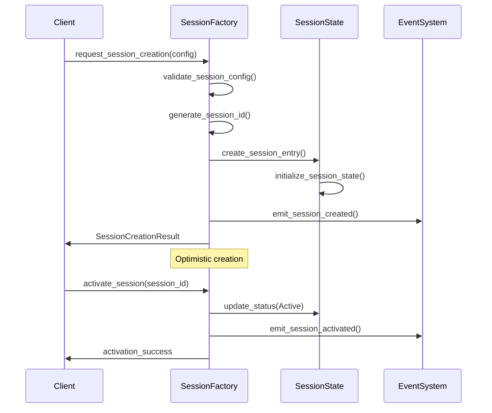
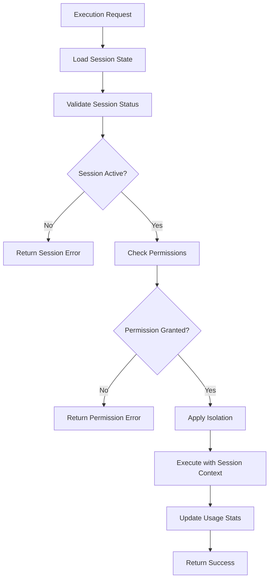

# Sessions Module - Session Lifecycle Management

The sessions module manages the complete lifecycle of execution sessions, from creation through termination, providing the execution context for all capabilities.

## Module Purpose

The sessions module is responsible for creating new execution sessions with proper configuration, managing session state and lifecycle, enforcing session-level permissions and constraints, and providing isolation boundaries between different execution contexts.

## Module Architecture

## Components

### lifecycle.rs - Session Factory & Management

This component implements the session factory pattern for creating and managing sessions through a comprehensive state lifecycle.

The SessionFactory maintains a registry of active sessions, session configuration templates, and factory configuration. It creates sessions using an optimistic pattern by generating session IDs, creating session entries with addresses derived from the session ID, storing entries in active sessions, and emitting session created events. Session activation involves validating that sessions can be activated, updating status to active, and emitting session activated events.

### state.rs - Session State Management

This component defines session state structures and management logic including session configuration with maximum duration, permissions, and settings. Session permissions define what the session can do including executing functions, composing functions, reading cross-session data, and writing cross-session data. Session settings configure behavior such as auto-expiration, execution logging, and performance monitoring.

The SessionState account structure includes session configuration, current status, permissions, creation and expiration timestamps, and usage statistics.

### isolation.rs - Session Isolation

This component implements session isolation and security boundaries through multiple mechanisms.

The SessionIsolationManager maintains session permission boundaries, resource quotas per session, and data access policies. It validates session resource access by checking permission boundaries, resource quotas, and data access policies. Isolation enforcement applies permission constraints, resource limits, and data access restrictions to execution contexts.

## Session Lifecycle Flow

### Session Creation Flow

### Session Execution Flow

## Integration Points

### Eval Module Integration

The evaluation processor validates sessions for execution by loading session state, validating session status for active state, validating permissions for function execution capability, checking expiration against current time, and returning session validation results with session ID, permissions, and remaining time.

### Event System Integration

Session factories emit session created events with session details and configuration, and session activated events with session information and activation timestamps.

## Account Structures

### Session Account

The SessionState account includes session configuration, current status, permissions, creation and expiration timestamps, and usage statistics. The account defines INIT_SPACE including discriminator, configuration space, status space, permissions space, timestamps, and usage statistics space.

### Session Instructions Accounts

CreateSession accounts include the creator as a signer and payer, the session account initialized with proper space allocation and PDA derivation using session and creator key seeds, and the system program. ActivateSession accounts include the authority as a signer and the mutable session account.

## Error Handling

### Session Errors

Session errors include SessionNotFound for missing sessions, SessionNotActive for inactive sessions, SessionExpired for expired sessions, PermissionDenied for insufficient permissions, InvalidConfiguration for invalid session configuration, CreationFailed for session creation failures, ActivationFailed for activation failures, QuotaExceeded for resource quota violations, and PolicyViolation for data access policy violations.

## Events

### Session Events

Session events include SessionCreated with session ID, address, creator, configuration, and creation timestamp. SessionActivated includes session ID, address, and activation timestamp. SessionExpired includes session ID, address, and expiration timestamp. SessionClosed includes session ID, address, close timestamp, and reason.

## Performance Optimizations

### Session Caching

Session caching uses an optimistic session manager with LRU cache for session entries, pending operations tracking, and performance metrics. The manager provides optimistic session retrieval by checking cache first and loading from account if not cached, updating cache with loaded sessions, and recording cache hits and misses. Optimistic session creation creates sessions immediately in cache, marks operations as pending confirmation, and provides immediate session access for subsequent operations.

## Testing Patterns

### Session Testing Utilities

Session testing includes testing session creation with mock session configuration, verifying session ID generation and status assignment. Session activation testing creates sessions with mock configuration, activates sessions using session IDs, and verifies successful activation results. 