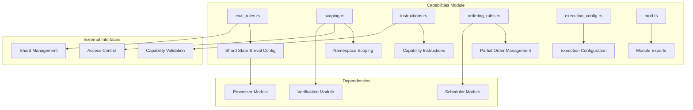
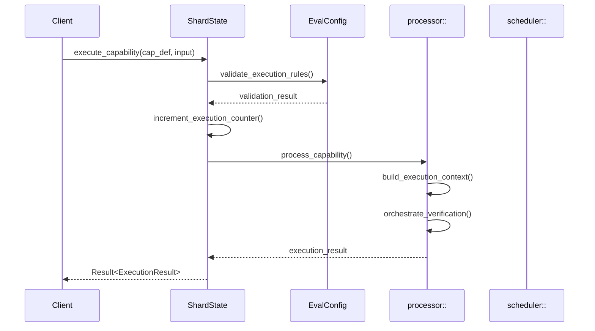
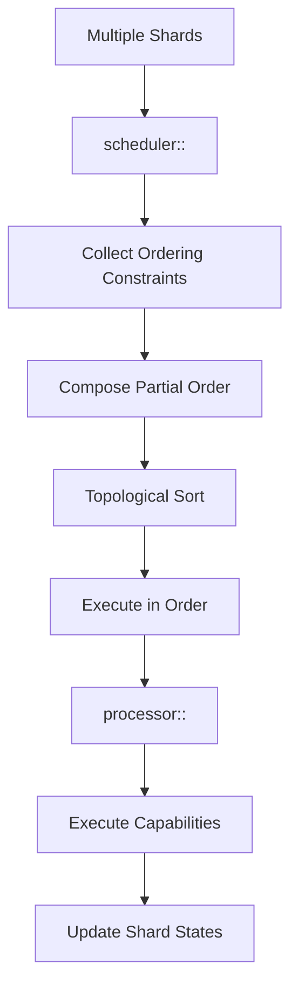
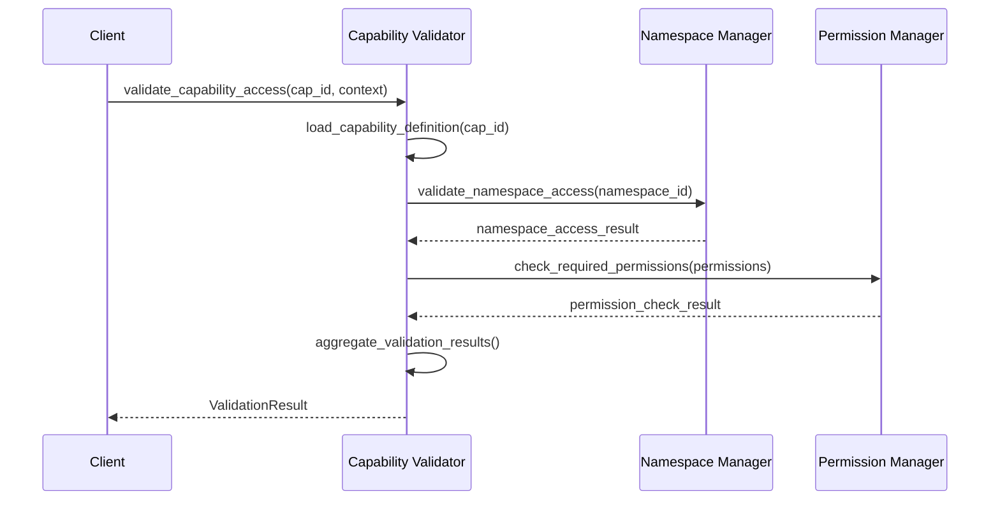
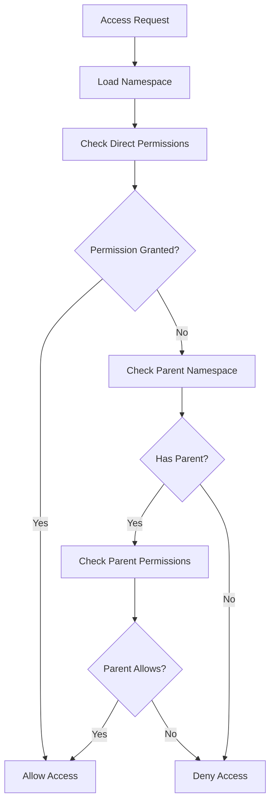

# Capabilities Module - Capability Definitions & Shards

The capabilities module manages capability definitions and implements shard-based execution with embedded evaluation logic within the Valence Protocol.

## Module Purpose

The capabilities module is responsible for defining what capabilities are and their properties, managing shard state with embedded evaluation logic, implementing namespace-based access control through scoping, managing capability-level permissions, and coordinating with singleton modules for execution.

## Module Architecture

## Components

### eval_rules.rs - Shard State & Evaluation Configuration

This component manages shard state with embedded evaluation logic. The ShardState account contains authority that manages the shard, processor program address for execution, pause state, total executions counter, shard version, PDA bump seed, and evaluation configuration. The EvalConfig structure defines maximum execution time allowed, maximum compute units allowed, execution recording settings, and default verification function requirements. Shards embed evaluation logic by default, providing simple deployment, better performance through reduced CPI calls, and tighter coupling between state and evaluation rules.

### scoping.rs - Namespace Scoping & Access Control

This component implements namespace-based access control and capability scoping. The CapabilityDefinition struct contains unique capability identifier, capability type (Function, DataAccess, SystemAdmin, etc.), capability scope with namespace restrictions, required permissions, and verification requirements. The NamespaceManager validates object access within namespaces, verifies capability composition rules, and enforces permission boundaries. Scoping ensures capabilities only access objects within their authorized namespaces.

### ordering_rules.rs - Partial Order Management

This component manages ordering constraints for multi-shard coordination. The PartialOrder structure defines execution ordering with unique identifier, ordering constraints list, and priority level. OrderingConstraint types include FIFO for first-in-first-out ordering, Priority-based ordering, and Dependency-based ordering with before/after relationships. The OrderingRuleRegistry maintains available ordering rules and applies them to compose partial orders from multiple shards.

### execution_config.rs - Execution Configuration

This component defines execution configuration for capabilities. The ExecutionConfig includes execution mode (Sequential, Parallel, Conditional), resource limits with compute units and memory allocation, timeout settings, and retry policies. CompleteExecutionConfig combines base configuration with app-specific settings for comprehensive execution control.

## Shard-Based Execution Flow

### Capability Execution with Shards

### Multi-Shard Coordination

## Capability Validation Flow

### Capability Access Validation

### Namespace Scoping Flow

## Integration Points

### Processor Module Integration

The processor:: module handles stateless execution orchestration for capabilities. When a shard executes a capability, it delegates to the processor for context building through the ContextBuilder, verification orchestration via the VerificationOrchestrator, and execution engine operations. The processor maintains no state between executions, ensuring clean execution semantics.

### Scheduler Module Integration

The scheduler:: module manages multi-shard coordination. When multiple shards need coordinated execution, the scheduler collects ordering constraints from each shard's PartialOrder, composes them using the PartialOrderComposer, performs topological sorting to determine execution order, and manages the execution queue. This ensures proper ordering across shard boundaries.

### Verification Module Integration

Capability validation integrates with the verification:: module to execute verification chains. The shard's EvalConfig specifies default verification functions, which are combined with capability-specific verifications. The verification module executes these functions as pure predicates, returning aggregated results for access control decisions.

## Account Structures

### Shard State Account

The ShardState account is the primary account for capability execution, containing authority for shard management, processor program address, pause state, execution counter, version and bump seed, and embedded EvalConfig. The account uses PDA derivation with seeds ["shard_state"] and requires ShardState::SPACE allocation.

### Capability Definition Structure

The CapabilityDefinition is passed as instruction data and includes capability identifier, type, and scope, namespace restrictions for access control, required permissions and verifications, associated function identifiers, and execution configuration overrides.

## Error Handling

### Capability Errors

Capability errors include CapabilityNotFound, InvalidCapabilityType, NamespaceAccessDenied, PermissionNotSatisfied, ObjectNotInNamespace, OperationNotAllowed, ResourceQuotaExceeded, and InvalidNamespaceHierarchy.

### Namespace Errors

Namespace errors include NamespaceNotFound, ParentNamespaceNotFound, NamespaceAlreadyExists, CircularDependency, and NamespaceScopingError.

## Events

### Capability Events

Capability events include CapabilityRegistered with capability ID, type, namespace ID, and registration timestamp. CapabilityExecuted includes capability ID, session ID, caller, execution time, and success status. NamespaceCreated includes namespace ID, optional parent namespace, and creation timestamp. NamespaceAccessGranted includes namespace ID, requester, operation, and grant timestamp.

## Performance Optimizations

### Capability Caching

Optimized capability management uses caching for capability definitions, namespace access results, permission check results, and performance metrics. The OptimizedCapabilityManager validates capabilities with caching by checking capability cache, namespace cache with keys combining namespace ID and caller, permission cache with keys combining capability ID and caller, and returns capability validation results with cached data when available.

## Testing Patterns

### Capability Testing

Capability testing includes capability validation testing to verify proper access validation with test capabilities and execution contexts. Namespace scoping testing creates parent and child namespaces, tests access validation with different operation types and requesters, and verifies proper inheritance and restriction enforcement. 