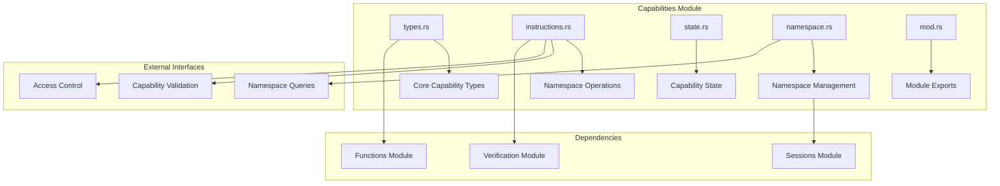
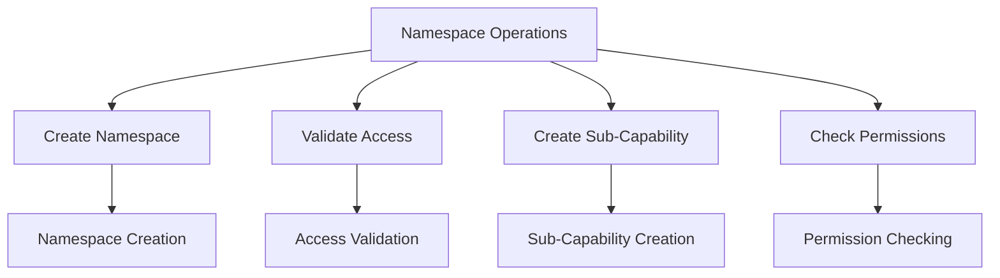
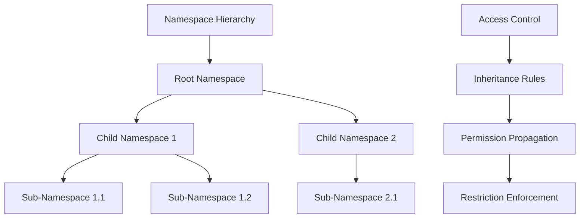
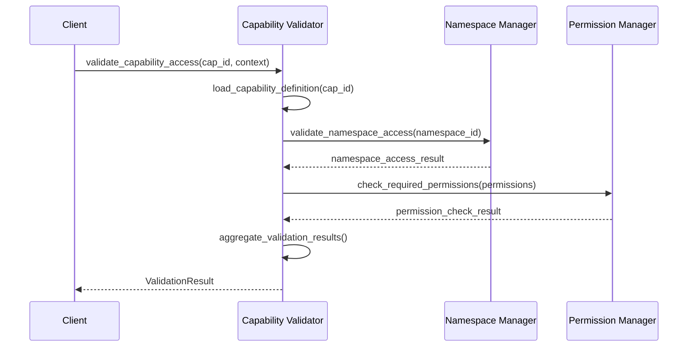
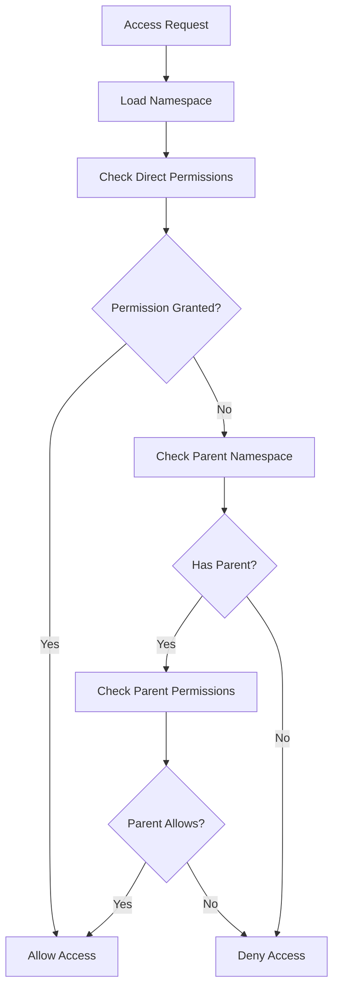

# Capabilities Module - Capability Definitions & Scoping

The capabilities module manages capability definitions and implements namespace-based scoping for access control within the Valence Protocol.

## Module Purpose

The capabilities module is responsible for defining what capabilities are and their properties, implementing namespace-based access control, managing capability-level permissions, and validating capability access requests.

## Module Architecture

## Components

### types.rs - Core Capability Types

This component defines the core capability types and data structures. The CapabilityDefinition struct contains unique capability identifier, capability type, capability scope, required permissions, associated functions, namespace restrictions, and verification requirements. The CapabilityType enumeration includes Function execution capability, DataAccess capability, SystemAdmin capability, SessionManagement capability, and cross-capability Composition. The CapabilityScope defines namespace identifier, accessible objects within namespace, allowed operations, and resource limits.

### instructions.rs - Namespace Operations

This component implements namespace scoping operations and access control logic through namespace creation, access validation, sub-capability creation, and permission checking.

The NamespaceCapability struct provides scoped access with namespace identifier, accessible objects, allowed operations, resource allocation, and optional parent capability. It includes methods to create new namespace capabilities, check object access permissions, check operation permissions, and create sub-capabilities with restricted access that verify all restricted objects are within the parent capability.

### state.rs - Capability State Management

This component manages capability state and persistence. The CapabilityEntry contains capability definition, registration timestamp, last updated timestamp, usage statistics, and status. CapabilityUsageStats tracks total executions, total execution time, average execution time, success rate, and last execution timestamp. CapabilityStatus includes Active, Disabled, Deprecated, and Maintenance states.

### namespace.rs - Namespace Management

This component implements namespace creation, management, and hierarchical access control through a namespace hierarchy with root and child namespaces, access control with inheritance rules, permission propagation, and restriction enforcement.

The NamespaceManager maintains namespace hierarchy through a tree structure, access control policies, and resource quotas per namespace. The NamespaceNode represents hierarchy nodes with namespace identifier, optional parent namespace, child namespaces, objects in the namespace, and namespace permissions. The manager creates new namespaces by validating parent existence, creating namespace nodes, adding to the tree, and updating parent children lists. It validates namespace access by checking direct permissions and inherited permissions from parent namespaces.

## Capability Validation Flow

### Capability Access Validation

### Namespace Scoping Flow

## Integration Points

### Eval Module Integration

Capability validation in the eval module loads capability definitions, validates namespace access, checks required permissions, and aggregates results. The CapabilityValidator validates capability access by loading capability definitions, validating namespace access for the capability scope, checking required permissions against the execution context, and returning aggregated validation results with capability ID, namespace access status, permissions satisfaction, verification functions, and function chain.

### Functions Module Integration

Capability-function binding validates that capabilities allow function execution, then executes functions in sequence. The FunctionExecutor executes capability functions by validating the capability type is Function, executing functions in sequence using function IDs from the capability definition, and returning function execution results with capability ID and individual function results.

## Account Structures

### Capability Registry Account

The CapabilityRegistry contains registered capabilities, namespace hierarchy, access policies, and registry metadata.

### Namespace Account

The NamespaceAccount includes namespace definition, objects in namespace, permissions, and resource quotas.

## Error Handling

### Capability Errors

Capability errors include CapabilityNotFound, InvalidCapabilityType, NamespaceAccessDenied, PermissionNotSatisfied, ObjectNotInNamespace, OperationNotAllowed, ResourceQuotaExceeded, and InvalidNamespaceHierarchy.

### Namespace Errors

Namespace errors include NamespaceNotFound, ParentNamespaceNotFound, NamespaceAlreadyExists, CircularDependency, and NamespaceScopingError.

## Events

### Capability Events

Capability events include CapabilityRegistered with capability ID, type, namespace ID, and registration timestamp. CapabilityExecuted includes capability ID, session ID, caller, execution time, and success status. NamespaceCreated includes namespace ID, optional parent namespace, and creation timestamp. NamespaceAccessGranted includes namespace ID, requester, operation, and grant timestamp.

## Performance Optimizations

### Capability Caching

Optimized capability management uses caching for capability definitions, namespace access results, permission check results, and performance metrics. The OptimizedCapabilityManager validates capabilities with caching by checking capability cache, namespace cache with keys combining namespace ID and caller, permission cache with keys combining capability ID and caller, and returns capability validation results with cached data when available.

## Testing Patterns

### Capability Testing

Capability testing includes capability validation testing to verify proper access validation with test capabilities and execution contexts. Namespace scoping testing creates parent and child namespaces, tests access validation with different operation types and requesters, and verifies proper inheritance and restriction enforcement. 