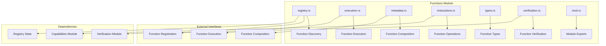
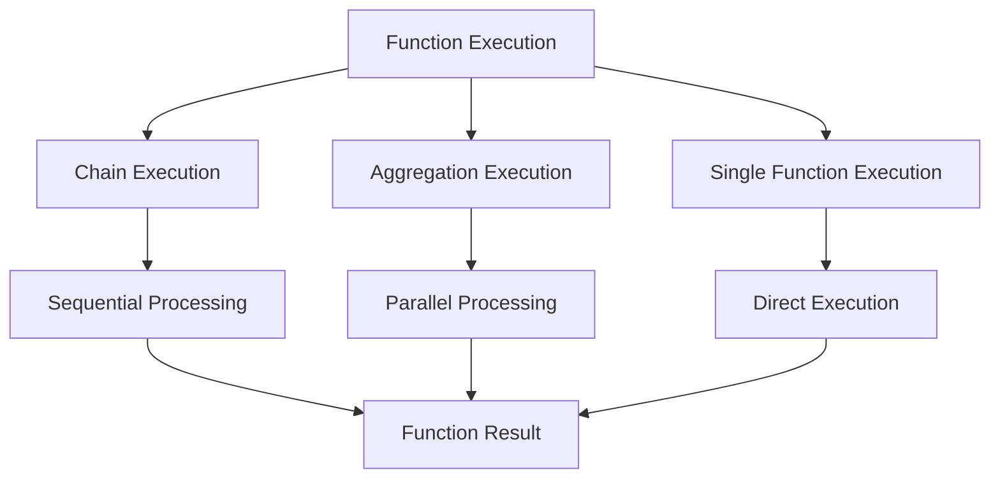
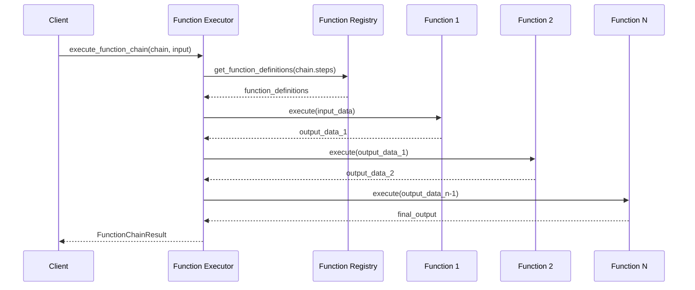
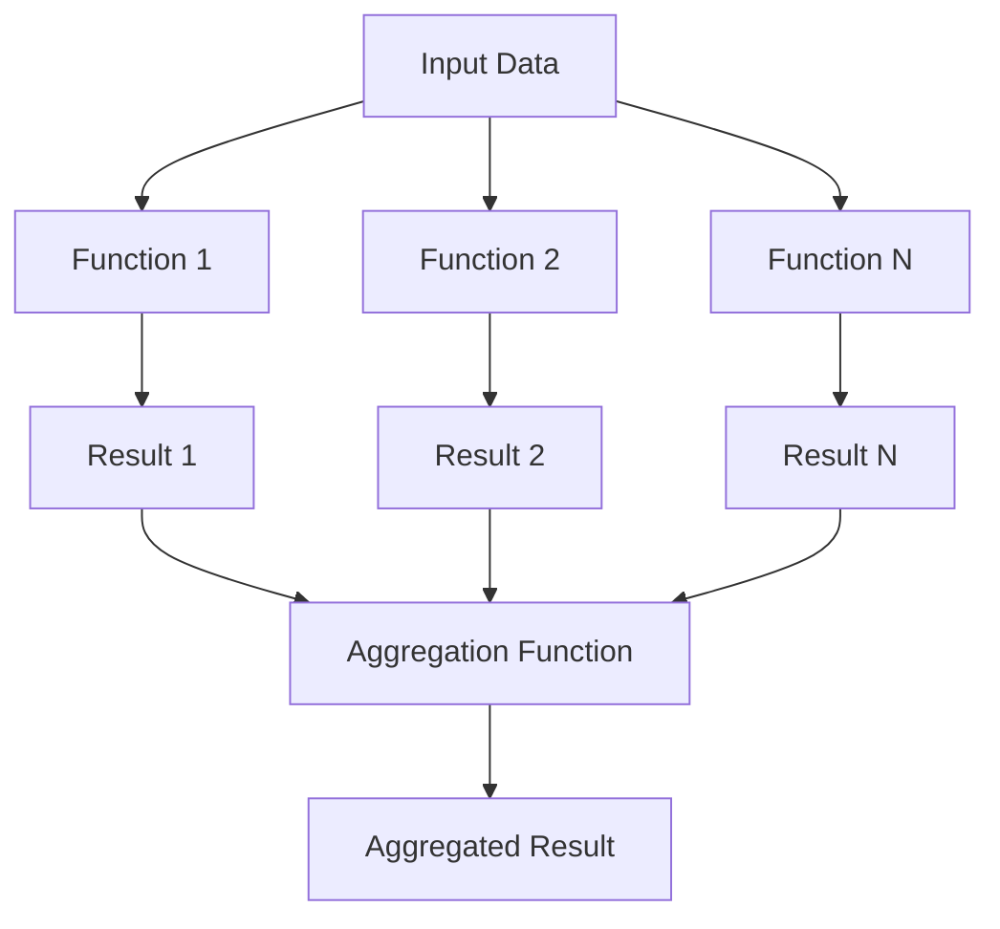

# Functions Module - Function Registry & Composition

The functions module manages the function registry and enables sophisticated function composition patterns for building complex capabilities.

## Module Purpose

The functions module is responsible for registering and discovering available functions, creating chains and aggregations of functions, managing function execution flow, and tracking function metadata and relationships.

## Module Architecture

## Components

### registry.rs - Function Discovery & Registration

This component manages function registration and discovery within the system. The FunctionRegistry maintains registered functions, function categories, function dependencies, and registry metadata. It provides methods to register new functions by validating function definitions, creating function entries, adding to registry, updating categories, and updating dependencies. The discovery system finds functions by criteria, matches functions against criteria, sorts by relevance, and returns function definitions. Function retrieval gets functions by ID with error handling for missing functions.

### execution.rs - Function Execution Coordination

This component coordinates function execution including chains and aggregations through sequential processing for chain execution, parallel processing for aggregation execution, and direct execution for single functions.

The FunctionExecutor maintains function registry reference, execution context, and performance metrics. It executes function chains by processing each step in sequence, updating data for next step, and collecting step results. Function aggregation executes functions in parallel, applies aggregation logic, and returns aggregated results. Single function execution gets function definitions, validates execution permissions, executes functions with timing, and updates metrics.

### metadata.rs - Function Composition Management

This component manages function composition metadata and relationships. The FunctionCompositionState contains composition identifier, composition type, function dependencies, and composition metadata. FunctionChain defines chain identifier, function steps in order, execution mode, and chain metadata. FunctionStep specifies function identifier, input mapping from previous step, output mapping to next step, conditional execution, and error handling. FunctionAggregation includes aggregation identifier, functions to aggregate, aggregation mode, and aggregation metadata. AggregationMode supports combining all outputs, selecting best output, majority vote, weighted average, and custom aggregation functions.

### types.rs - Function Type System

This component defines function types and interfaces. FunctionDefinition contains function identifier, name, description, function type, input schema, output schema, function implementation, required capabilities, and function metadata. FunctionType includes Pure functions with no side effects, StateModifying functions, Verification functions, Aggregation functions, and Composition functions. FunctionResult contains function identifier, execution success, output data, error message if failed, execution time in milliseconds, and gas consumed. FunctionError includes FunctionNotFound, InvalidInput, ExecutionFailed, PermissionDenied, Timeout, and ResourceExhausted.

## Function Execution Flow

### Function Chain Execution

### Function Aggregation Execution

## Integration Points

### Capabilities Module Integration

Function execution within capabilities builds function chains from capability functions and executes function chains within capability context. The CapabilityExecutor gets function chains from capabilities, executes function chains, and returns capability execution results with capability ID and function chain results.

### Verification Module Integration

Function verification integration runs verification functions, validates function input, executes verification chains, and ensures verification success before function execution. The FunctionExecutor executes functions with verification by getting function definitions, creating verification input with context and parameters, running verification chains, and executing functions only after successful verification.

## Events

### Function Events

Function events include FunctionRegistered with function ID, function type, and registration timestamp. FunctionExecuted includes function ID, execution time, success status, and gas consumed. FunctionChainExecuted includes chain ID, total steps, successful steps, and total execution time. FunctionAggregationCompleted includes aggregation ID, aggregation mode, function count, and execution time.

## Performance Optimizations

### Function Caching

Optimized function execution uses caching for function results, function definitions, execution plans, and performance metrics. The OptimizedFunctionExecutor executes functions with caching by creating cache keys, checking result cache, executing functions when not cached, caching results, and recording cache metrics.

## Testing Patterns

### Function Testing

Function testing includes function registration testing to verify proper function registration with mock function definitions. Function chain execution testing validates complete chain execution with mock chains and input data. Function aggregation testing verifies aggregation execution with mock aggregations and proper result aggregation. 