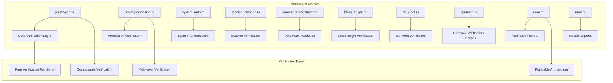
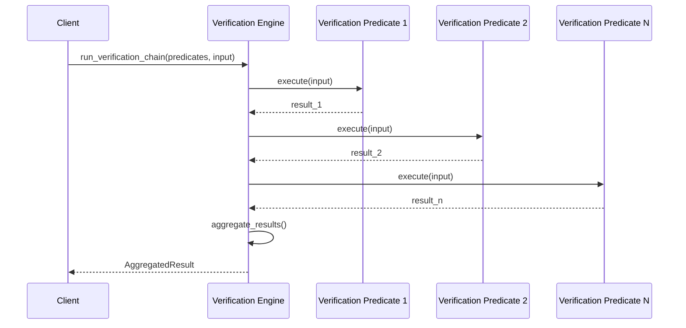
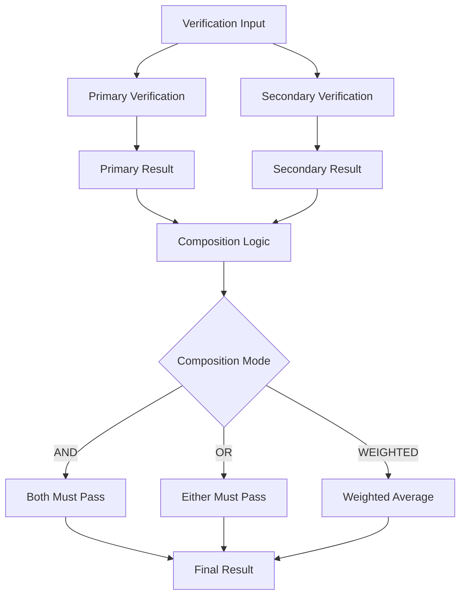

# Verification Module - Verification Function System

The verification module implements a comprehensive verification function system that validates execution conditions through pure, composable verification functions.

## Module Purpose

The verification module is responsible for running pure verification functions, combining multiple verification functions through composition, managing verification function lifecycle, and aggregating verification results.

## Module Architecture

## Components

### predicates.rs - Core Verification Logic

This component implements the core verification predicate system. The VerificationPredicate contains predicate identifier, predicate type, verification function, and predicate metadata. The VerificationInput includes execution context, verification parameters, and additional verification data. The VerificationOutput contains verification result, verification details, additional output data, and verification score from 0-100. The predicate system executes verification functions, validates results, and composes with other predicates using different composition modes.

### basic_permission.rs - Permission Verification

This component implements basic permission verification functions. The BasicPermissionVerifier provides session permission verification by extracting session from context, loading session state, and checking if session can execute functions. It also handles capability permission verification by extracting capability ID from context, loading capability definition, and checking required permissions against the caller.

### system_auth.rs - System Authorization

This component implements system-level authorization verification. The SystemAuthVerifier checks system authority by verifying if the caller is a system authority and provides admin permission verification by checking admin permissions for the caller. Both verification functions return standardized VerificationOutput with success status, details, and scoring.

### zk_proof.rs - Zero-Knowledge Proof Verification

This component implements zero-knowledge proof verification functions. The ZkProofVerifier extracts proof from verification data, extracts public inputs from parameters, verifies the proof using cryptographic verification, and returns verification results with success status and appropriate scoring.

## Verification Flow

### Verification Chain Execution

### Verification Composition

## Integration Points

### Eval Module Integration

Verification in the eval module executes verification functions by creating verification input with context, parameters, and verification data. The EvaluationProcessor runs verification chains by executing each verification function, collecting results, and aggregating results with overall success determination and total score calculation.

### Functions Module Integration

Function verification integration creates verification input from function definitions, runs function-specific verifications, and aggregates results. The FunctionVerifier verifies function execution by creating verification input, running verification functions from function requirements, and determining overall success based on all verification results.

## Verification Data Structures

### Verification Registry

The VerificationRegistry contains available verification functions, verification policies, and registry metadata. The VerificationFunction includes function identifier, name, description, function type, required parameters, and function implementation.

### Verification Results

The VerificationChainResult contains individual verification results, overall success status, total score, and execution time. The ComposedVerificationResult includes primary result, secondary result, composed result, and composition mode used.

## Error Handling

### Verification Errors

Verification errors include VerificationFailed, InvalidInput, Timeout, UnknownFunction, PermissionDenied, SessionNotFound, MissingSession, InvalidProof, and CompositionFailed.

## Events

### Verification Events

Verification events include VerificationExecuted with verification function, success status, execution time, and score. VerificationChainCompleted includes verification functions, overall success, total score, and execution time. VerificationComposed includes primary function, secondary function, composition mode, and composed result.

## Performance Optimizations

### Verification Caching

Optimized verification engine uses caching for verification results, verification functions, and performance metrics. The OptimizedVerificationEngine executes verification with caching by creating cache keys, checking result cache, executing verification when not cached, caching results, and recording cache metrics.

## Testing Patterns

### Verification Testing

Verification testing includes basic permission verification testing to verify proper session and capability permissions. Verification chain testing validates complete chain execution with multiple verification functions. ZK proof verification testing verifies zero-knowledge proof validation with mock proofs and inputs. 