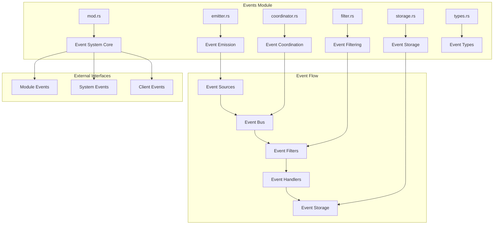
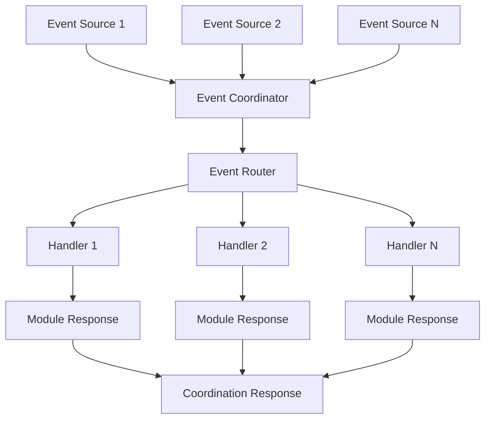
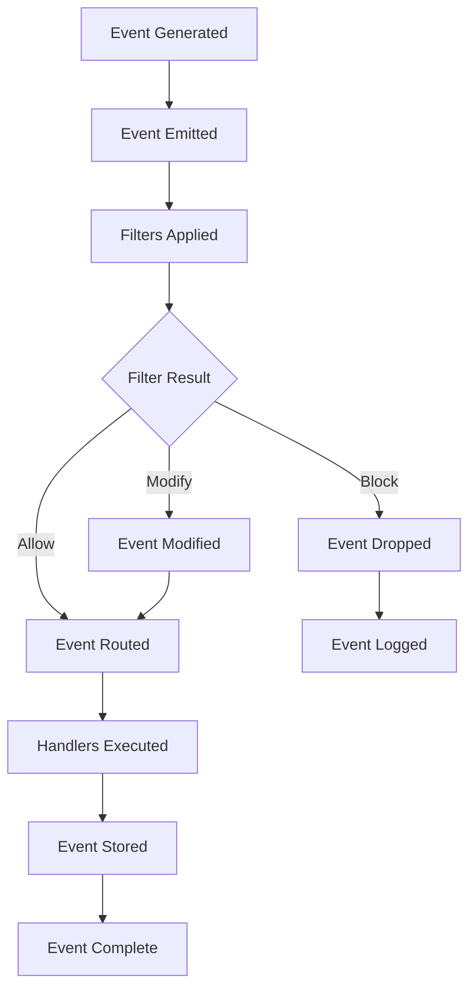
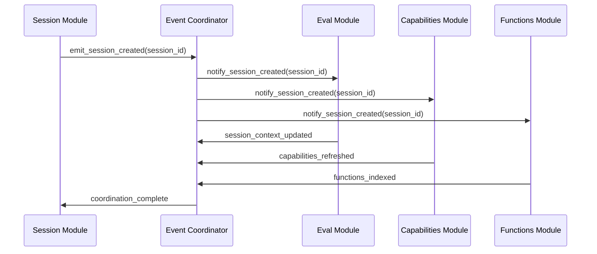

# Events Module - Event Coordination System

The events module provides a comprehensive event coordination system that enables communication between modules and external systems in the Valence Protocol.

## Module Purpose

The events module is responsible for broadcasting events from various system components, managing event flow between modules, filtering events based on criteria, and storing events for audit and replay capabilities.

## Module Architecture

## Components

### types.rs - Event Type System

This component defines the event type system and core event structures. The Event structure contains event identifier, event type, event data, event source, timestamp, and event metadata. EventType enumeration includes System events, Session events, Capability events, Function events, Verification events, and Custom events. SystemEventType covers system initialization, pause, resume, registry updates, and configuration changes. SessionEventType includes session creation, activation, pause, resume, expiration, and closure. EventData contains primary data, secondary data, and structured data with key-value pairs and related entities.

### emitter.rs - Event Emission

This component handles event emission from various system components. The EventEmitter manages event queue, event filters, event handlers, and emitter configuration. It emits events by applying filters, adding to queue, and processing immediately if configured. The emitter provides specialized methods for session events and capability events with proper metadata and timestamp handling. Event processing removes events from queue, finds appropriate handlers, processes through handlers, and stores events if configured.

### coordinator.rs - Event Coordination

This component coordinates event flow between different system components through event routing, handler registry, event statistics, and coordination policies.

The EventCoordinator applies coordination policies, routes events to appropriate handlers, collects handler responses, and updates statistics. The EventRouter uses routing rules and default handlers to determine event routing. Handler registration allows modules to register event handlers for specific event types. Coordination policies control event processing flow based on system state and configuration.

### filter.rs - Event Filtering

This component implements event filtering based on various criteria. The EventFilter trait defines filter method and filter name. FilterResult includes Allow, Block, Modify, and Transform options. SessionEventFilter manages allowed and blocked session IDs with allowlist and blocklist functionality. RateLimitFilter implements rate limiting per event type with configurable rate limits and time windows. Event filtering applies to all events before processing and routing.

### storage.rs - Event Storage

This component handles event persistence and retrieval. The EventStorage manages storage backend, storage configuration, and event indices. It stores events by serializing event data, storing in backend, updating indices, and applying retention policies. Event retrieval supports getting events by ID, querying events by criteria, and specialized queries for session events and capability events. EventQuery supports filtering by event type, session ID, capability ID, time range, result limiting, and sort ordering.

## Event Flow Patterns

### Event Lifecycle

### Cross-Module Event Coordination

## Integration Points

### Module Event Integration

Integration with eval module emits execution events for capability execution started and completed events. The EvaluationProcessor creates structured event data with execution details, timing information, and success status. Event emission includes primary data serialization, structured data with key-value fields, and related entity references.

### External System Integration

External system integration maps internal events to external formats and sends events to external systems. The ExternalSystemEventHandler handles event mapping configuration, external system client communication, and response processing. Event mapping transforms internal event structures to external system requirements.

## Event Statistics & Monitoring

### Event Metrics

The EventStatistics tracks total events processed, events by type, events by source, processing times, error counts, and handler performance. It records event processing with timing information, success status, and error tracking. Statistical analysis includes average processing time calculation, event distribution analysis, and performance monitoring.

## Error Handling

### Event Errors

Event errors include EmissionFailed, FilteringFailed, RoutingFailed, HandlerNotFound, StorageFailed, SerializationFailed, DeserializationFailed, RateLimitExceeded, and CoordinationFailed.

## Performance Optimizations

### Event Batching

The EventBatchProcessor implements batch configuration, current batch management, batch timer handling, and processing metrics. It adds events to batches, starts timers for first events, processes batches when conditions are met, and updates metrics with batch processing performance. Batching reduces processing overhead and improves throughput for high-volume event scenarios.

## Testing Patterns

### Event System Testing

Event system testing includes event emission testing to verify proper event queuing and processing. Event filtering testing validates filter behavior with allowed and blocked events. Event coordination testing verifies proper event routing and handler execution. Testing patterns use mock events, mock handlers, and verification of event processing statistics. 