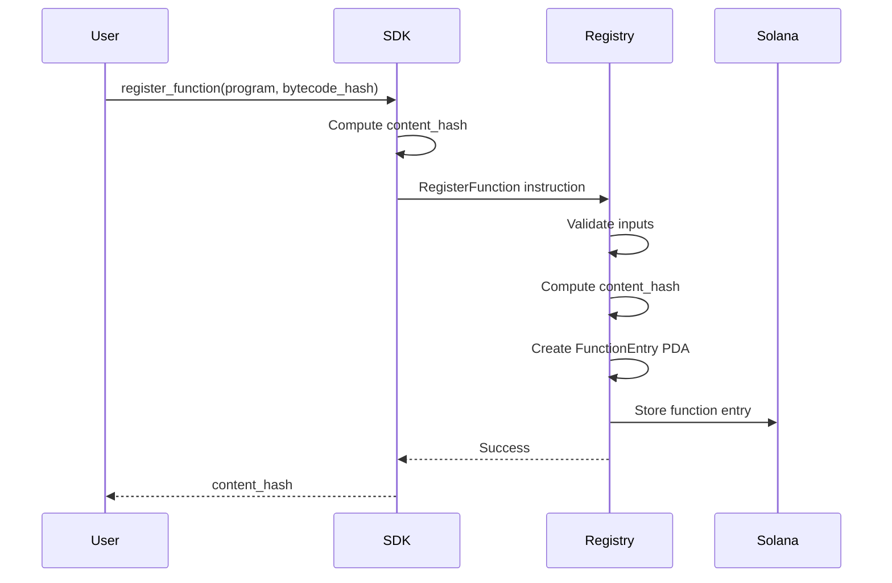
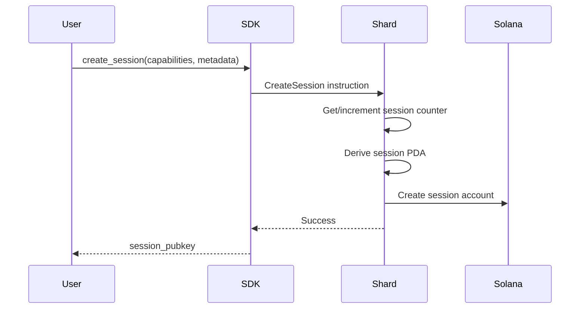
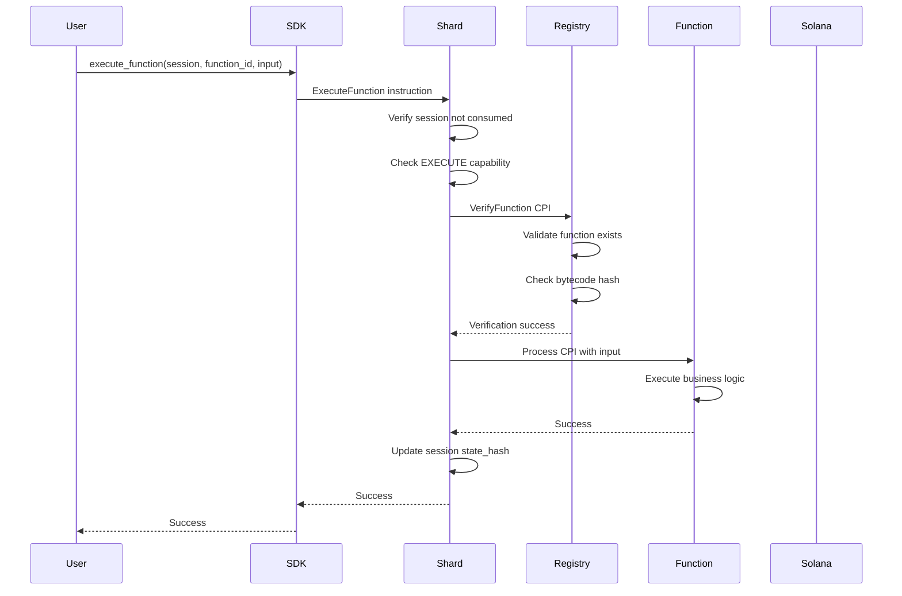

# Valence Protocol Architecture

## Overview

The Valence Protocol is a secure microkernel for Solana that enables safe, composable function execution with capabilities. The architecture creates a separation of concerns between function registration, session management, and execution, allowing for flexible and secure composition of on-chain operations.

## Core Design Principles

1. **Separation of Concerns**: Registry handles function data, Shard manages sessions and capabilities, functions contain business logic
2. **Capability-Based Security**: Fine-grained permissioning of operations sessions can perform
3. **Linear Type Semantics**: Sessions are consumed after use, preventing replay attacks and ensuring single-use semantics
4. **Content-Addressable Functions**: Functions are identified by their content hash, ensuring integrity
5. **Composability**: Functions can be composed through sessions with controlled capability delegation

## System Components

### 1. Registry Program (`programs/registry/`)

The Registry serves as the central catalog of available functions in the system.

**Key Responsibilities:**
- Function registration with bytecode validation
- Content hash computation for function identification
- Function verification before execution
- Authority management for function lifecycle

**Core Data Structures:**
```rust
pub struct FunctionEntry {
    pub program: Pubkey,           // Program implementing the function
    pub content_hash: [u8; 32],    // SHA256(program_id || bytecode_hash)
    pub bytecode_hash: [u8; 32],   // Hash of program bytecode
    pub authority: Pubkey,         // Who can deregister
    pub registered_at: i64,        // Timestamp
}
```

**Key Operations:**
- `register_function`: Registers a new function with bytecode hash
- `verify_function`: Verifies function integrity before execution
- `deregister_function`: Removes a function (authority only)

### 2. Shard Program (`programs/shard/`)

The Shard manages sessions and orchestrates secure function execution.

**Key Responsibilities:**
- Session lifecycle management (create, execute, consume)
- Capability enforcement and delegation
- Cross-program invocation (CPI) to execute functions
- State transition tracking through content hashing
- Counter-based nonce management for session uniqueness

**Core Data Structures:**
```rust
pub struct Session {
    pub owner: Pubkey,              // Session owner
    pub capabilities: Capabilities, // Bitmap of granted permissions
    pub nonce: u64,                 // Unique counter-based nonce
    pub state_hash: [u8; 32],       // Current state hash
    pub metadata: Vec<u8>,          // Session metadata
    pub created_at: i64,            // Creation timestamp
    pub consumed: bool,             // Linear type consumption flag
}

pub struct SessionCounter {
    pub owner: Pubkey,              // Counter owner
    pub counter: u64,               // Monotonically increasing counter
}

pub struct Capabilities(pub u64);  // Bitmap: READ | WRITE | EXECUTE | TRANSFER
```

**Key Operations:**
- `initialize_session_counter`: Sets up counter for session nonce generation
- `create_session`: Creates a new session with specified capabilities
- `execute_function`: Executes a registered function within session context and increments the session nonce
- `consume_session`: Marks session as consumed (linear type semantics)

### 3. Common Library (`programs/common/`)

Shared utilities and types used across all programs.

**Key Components:**
- `indexing::AccountIndex`: Efficient HashMap-based account indexing for O(1) lookups
- `program_ids`: System program addresses
- `bounds`: Safe arithmetic operations with overflow protection
- `validate_program`: Program validation utilities (currently bypassed for testing flexibility)
- `CommonError`: Error types including InvalidProgram, OutOfBounds, ArithmeticOverflow, AccountNotFound

### 4. SDK (`sdk/`)

Client-side library for interacting with the Valence Protocol.

**Key Features:**
- High-level API for all protocol operations
- Session builder pattern for ergonomic session creation
- Automatic transaction construction and signing
- Content hash computation utilities
- Automatic session counter initialization when needed

**Example Usage:**
```rust
// Create a client
let client = ValenceClient::new(cluster, payer, registry_id, shard_id)?;

// Register a function
let content_hash = client.register_function(
    program_id,
    bytecode_hash
)?;

// Create a session with capabilities
let session = client.create_session(
    Capabilities::READ | Capabilities::WRITE | Capabilities::EXECUTE,
    session_metadata
)?;

// Execute function
client.execute_function(
    session,
    program_id,
    bytecode_hash,
    input_data
)?;

// Consume session
client.consume_session(session)?;
```

## Data Flow

### Function Registration Flow



This diagram shows how functions are registered in the system. The user provides the program ID and bytecode hash to the SDK. The SDK computes a content hash and sends a registration instruction to the Registry program. The Registry validates the inputs, recomputes the content hash for verification, creates a Program Derived Address (PDA) for the function entry, and stores it on-chain. The content hash is returned to the user as a unique identifier for the registered function.

### Session Creation Flow



This diagram illustrates the session creation process. The user requests a new session with specific capabilities (READ, WRITE, EXECUTE, TRANSFER) and metadata. The SDK sends a CreateSession instruction to the Shard program, which retrieves and increments the user's session counter to ensure uniqueness. The Shard then derives a deterministic PDA using the owner's public key and the counter value, creates the session account on-chain with the specified capabilities, and returns the session's public key to the user for future operations.

### Function Execution Flow



This diagram shows the complete function execution flow. When a user wants to execute a function, they provide the session, function identifier, and input data. The Shard program first verifies that the session hasn't been consumed (enforcing linear type semantics) and checks that it has the EXECUTE capability. It then makes a Cross-Program Invocation (CPI) to the Registry to verify the function exists and its bytecode hash matches (note: for testing, a zero bytecode hash bypasses verification). Once verified, the Shard makes another CPI to the actual function program with the input data using the Anchor instruction discriminator. After successful execution, the Shard increments the session nonce and updates the session's state hash to reflect the state transition, ensuring a complete audit trail of all operations.

## Security Model

### Capability-Based Access Control

The protocol uses a bitmap-based capability system:

```
READ     = 1 << 0  // Can read data
WRITE    = 1 << 1  // Can write data
EXECUTE  = 1 << 2  // Can execute functions
TRANSFER = 1 << 3  // Can transfer ownership
```

Sessions are created with specific capabilities that limit what operations can be performed. This enables:
- Principle of least privilege
- Fine-grained access control
- Capability delegation patterns
- Secure multi-party interactions

### Linear Type Semantics

Sessions implement linear type semantics through the `consumed` flag:
- Each session can only be used once for its primary operation
- After use, sessions are marked as consumed
- Prevents replay attacks and double-spending
- Enables UTXO-like patterns for state management

### Content Addressing

Functions are identified by their content hash:
```
content_hash = SHA256(program_id || bytecode_hash)
```

This ensures:
- Integrity verification
- Immutable function references
- Protection against substitution attacks
- Deterministic function identification

**Note**: For testing purposes, the Registry allows bypassing bytecode verification when a zero hash `[0u8; 32]` is provided as the expected bytecode hash.

## Account Structure

### Program Derived Addresses (PDAs)

The protocol uses PDAs for deterministic account addresses:

1. **Registry Function Entry**:
   ```
   seeds = [FUNCTION_SEED, content_hash]
   ```

2. **Session Counter**:
   ```
   seeds = [SESSION_COUNTER_SEED, owner.key()]
   ```

3. **Session**:
   ```
   seeds = [SESSION_SEED, owner.key(), counter.to_le_bytes()]
   ```

### Account Relationships

```
Owner Account
    ├── SessionCounter (PDA)
    │   └── counter: u64
    └── Session[] (PDAs)
        ├── capabilities
        ├── state_hash
        └── consumed flag

Registry Program
    └── FunctionEntry[] (PDAs)
        ├── program
        ├── content_hash
        └── bytecode_hash
```

This diagram illustrates the hierarchical relationship between accounts in the Valence Protocol. Each owner account has an associated SessionCounter PDA that tracks the monotonically increasing counter used for session creation. The owner can have multiple Session PDAs, each with its own capabilities, state hash, and consumption status. Separately, the Registry program maintains FunctionEntry PDAs that store information about registered functions, including the program address, content hash, and bytecode hash.

## Error Handling

The protocol defines specific error types for each program:

**Registry Errors:**
- `ProgramMismatch`: Function program doesn't match expected
- `BytecodeMismatch`: Bytecode hash verification failed
- `ContentHashMismatch`: Content hash doesn't match computed
- `UnauthorizedDeregistration`: Caller not authorized

**Shard Errors:**
- `InsufficientCapabilities`: Session lacks required capability
- `SessionConsumed`: Session already used
- `UnauthorizedCaller`: Caller not session owner
- `InvalidProgram`: Program validation failed
- `CounterNotInitialized`: Session counter not set up

## Implementation Details

### Function Invocation

When the Shard program invokes a function via CPI, it uses Anchor's instruction discriminator format:
- The discriminator is the first 8 bytes of `SHA256("global:process")`
- For the `process` instruction: `[147, 104, 175, 139, 110, 254, 236, 21]`
- Input data is serialized using Borsh format: `[discriminator][length][data]`

### Session State Updates

During `execute_function`, the session state is updated as follows:
1. The nonce is incremented to ensure each state is unique
2. A new state hash is computed: `SHA256(prev_state_hash || function_hash || input_data || new_nonce)`
3. This creates an immutable audit trail of all operations

## Performance Considerations

1. **Account Size Optimization**: 
   - Fixed-size accounts where possible
   - Efficient packing of capability bitmaps
   - Minimal metadata storage

2. **Compute Unit Optimization**:
   - Efficient hash computations
   - Minimal CPI overhead
   - Batch operations where possible

3. **Parallelization**:
   - Independent sessions can execute in parallel
   - No global state bottlenecks
   - Sharded architecture enables horizontal scaling

## Testing Strategy

The protocol includes the following tests:

1. **Unit Tests**: Each program has isolated unit tests
2. **Integration Tests**: End-to-end flow testing
3. **Mock Tests**: Fast tests without validator
4. **Security Tests**: Capability enforcement, replay prevention
5. **Performance Tests**: Compute unit usage, throughput

## Deployment Architecture

The system consists of two main on-chain programs: the Registry program (responsible for function registration and verification) and the Shard program (managing sessions and orchestrating function execution). Both programs are deployed on the Solana runtime and interact with each other through Cross-Program Invocations (CPIs). This clean separation of concerns allows for independent upgrades and modular system design.

## Conclusion

The Valence Protocol provides a foundation for secure, composable on-chain computation. By separating concerns between function registration, session management, and execution, it enables flexible patterns while maintaining strong security guarantees. The capability-based security model and linear type semantics ensure safe execution, while the content-addressable function system provides integrity and composability.

This architecture enables developers to build complex on-chain applications with confidence, knowing that the underlying protocol provides strong safety and security guarantees while remaining flexible and performant.