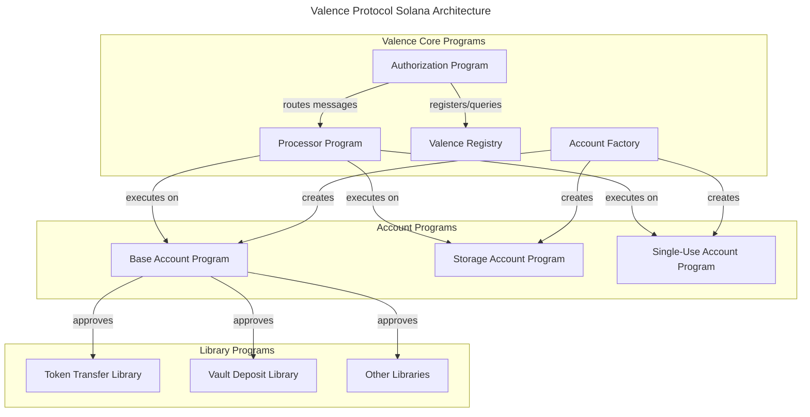

# Valence Protocol: Solana Implementation Architecture

This document outlines the architectural plan for implementing Valence Protocol in the SVM, focusing on the processor, account, and library components while addressing Solana-specific constraints.

## System Overview



## Core Components

### 1. Authorization Program

The Authorization Program is the entry point for Valence Programs on Solana, managing permissions and routing messages to the Processor Program.

**Program Accounts Structure:**
```
AuthorizationState {
    owner: Pubkey,                      // Program authority
    sub_owners: Vec<Pubkey>,            // Secondary authorities
    processor_program_id: Pubkey,       // Processor program ID
    execution_counter: u64,             // Unique ID for executions
    valence_registry: Pubkey,           // Address of the Valence Registry
}

Authorization {
    label: String,                      // Unique identifier
    owner: Pubkey,                      // Owner of this authorization
    is_active: bool,                    // Whether authorization is active
    permission_type: PermissionType,    // Who can use this authorization
    allowed_users: Vec<Pubkey>,         // If permission type is allowlist
    not_before: i64,                    // Earliest valid timestamp
    expiration: Option<i64>,            // Expiration timestamp
    max_concurrent_executions: u32,     // Concurrent execution limit
    priority: Priority,                 // Message priority level
    subroutine_type: SubroutineType,    // Atomic or NonAtomic execution
}

CurrentExecution {
    id: u64,                            // Unique execution ID
    authorization_label: String,        // Related authorization
    sender: Pubkey,                     // Transaction initiator
    start_time: i64,                    // Start timestamp
}
```

**Key Instructions:**
- **Initialize**: Create program state with owner and registry address
- **CreateAuthorization**: Create new authorization rules
- **ModifyAuthorization**: Update authorization parameters
- **SendMessages**: Submit messages for execution with authorization
- **ReceiveCallback**: Process callbacks from the Processor

**Optimizations:**
- Batch operations in single instructions
- Use compact data structures and serialization
- Implement lazy loading for account data
- Cache authorization lookups

### 2. Valence Registry

The Valence Registry maintains information about approved libraries and their configurations.

**Program Accounts Structure:**
```
RegistryState {
    owner: Pubkey,                      // Registry authority
    authorization_program_id: Pubkey,   // Linked Authorization Program
    account_factory: Pubkey,            // Address of Account Factory
}

LibraryInfo {
    program_id: Pubkey,                 // Library program ID
    library_type: String,               // Library type identifier
    description: String,                // Human-readable description
    is_approved: bool,                  // Whether library is globally approved
}
```

**Key Instructions:**
- **RegisterLibrary**: Add new library to registry
- **UpdateLibraryStatus**: Approve or revoke library
- **QueryLibrary**: Get library information

### 3. Processor Program

The Processor Program executes messages received from the Authorization Program, maintaining priority queues and enforcing execution rules.

**Program Accounts Structure:**
```
ProcessorState {
    authorization_program_id: Pubkey,    // Authorization program ID
    is_paused: bool,                     // Processor active state
    high_priority_queue: QueueState,     // High priority message queue
    medium_priority_queue: QueueState,   // Medium priority message queue
    low_priority_queue: QueueState,      // Low priority message queue
}

QueueState {
    head: u64,                           // Queue head index
    tail: u64,                           // Queue tail index
}

MessageBatch {
    execution_id: u64,                   // Unique execution ID
    messages: Vec<ProcessorMessage>,     // Messages to execute
    subroutine: SubroutineType,          // Atomic or NonAtomic
    expiration_time: Option<i64>,        // Expiration timestamp
    priority: Priority,                  // Priority level
}

PendingCallback {
    execution_id: u64,                   // Related execution ID
    callback_address: Pubkey,            // Callback recipient
    result: ExecutionResult,             // Execution outcome
    executed_count: u32,                 // Number of executed msgs
    error_data: Option<Vec<u8>>,         // Error information
}
```

**Key Instructions:**
- **EnqueueMessages**: Add messages to a priority queue
- **ProcessTick**: Execute messages from queues (permissionless)
- **ExecuteAtomic**: Run atomic subroutine (internal)
- **ExecuteNonAtomic**: Run non-atomic subroutine (internal)
- **SendCallback**: Send execution results back to Authorization
- **PauseProcessor**: Pause message processing
- **ResumeProcessor**: Resume message processing

**Optimizations:**
1. **Chunked Execution**: Process messages in optimal-sized chunks
2. **Compute Budget Management**: Dynamically adjust compute limits
3. **Parallel Processing**: Split large batches across transactions
4. **Efficient Queue Implementation**: Use ring buffers or linked lists
5. **Conditional Execution**: Skip unnecessary CPIs when possible

### 4. Account Programs

#### Base Account Program

Holds assets (tokens) and allows approved libraries to execute operations. Accounts can safely custody both SPL tokens and native SOL.

**Program Accounts Structure:**
```
AccountState {
    owner: Pubkey,                      // Account owner
    approved_libraries: Vec<Pubkey>,    // Approved library programs
    vault_authority: Pubkey,            // PDA for token custody
    vault_bump_seed: u8,                // PDA bump seed
    token_accounts: Vec<Pubkey>,        // Associated token accounts
}

ApprovalNonce {
    library: Pubkey,                    // Library program ID 
    nonce: u64,                         // Unique approval nonce
}
```

**Key Instructions:**
- **Initialize**: Create new account with owner
- **ApproveLibrary**: Approve library program
- **RevokeLibrary**: Remove library approval
- **ExecuteInstruction**: Execute instruction on behalf of library
- **TransferOwnership**: Change account owner
- **CreateTokenAccount**: Create associated token account for a mint
- **CloseTokenAccount**: Close an associated token account

**Optimizations:**
1. **Token Account Prefetching**: Cache token account lookups
2. **Approval Batching**: Approve multiple libraries at once
3. **Stateless Verification**: Use PDAs and seeds for validation
4. **Bulk Token Operations**: Batch multiple token operations

#### Storage Account Program

Extends Base Account with key-value storage capabilities. Can store both tokens and arbitrary data in an efficient format.

**Program Accounts Structure:**
```
StorageAccountState {
    base_account: AccountState,          // Base account state
    storage_authority: Pubkey,           // PDA for storage management
}

StorageItem {
    key: String,                         // Storage key
    value_type: ValueType,               // Data type identifier
    value: Vec<u8>,                      // Serialized value data
}
```

**Key Instructions:**
- **Initialize**: Create storage account
- **SetItem**: Store key-value pair
- **GetItem**: Retrieve value by key
- **DeleteItem**: Remove key-value pair
- **BatchUpdate**: Update multiple items at once

**Optimizations:**
- Use efficient serialization formats
- Optimize storage layout for common access patterns
- Implement lazy loading for large values

#### Single-Use Account Program

A specialized account that enforces a "use-once" rule where all funds/data must be transferred out on first use. Useful for atomic operations, escrow patterns, and enhanced security.

**Program Accounts Structure:**
```
SingleUseAccountState {
    base_account: AccountState,           // Base account state
    was_used: bool,                       // Whether account was used
    required_destination: Option<Pubkey>, // Required destination (if any)
    expiration_time: Option<i64>,         // Auto-close timestamp
}
```

**Key Instructions:**
- **Initialize**: Create single-use account with owner
- **Execute**: Run operation and ensure full withdrawal (fails if anything remains)
- **EmergencyRecover**: Allow owner to recover funds after expiration

**Security Mechanisms:**
- Prevents funds from being left behind after use
- Account automatically marks itself as used after first operation
- Validates all token accounts are empty after execution
- Enforced destination if specified during initialization
- Time-based expiration with recovery mechanism

### 5. Account Factory Program

The Account Factory enables efficient creation and initialization of accounts in a single transaction, reducing the typical multi-step process of account creation.

**Program Accounts Structure:**
```
FactoryState {
    owner: Pubkey,                      // Factory owner
    valence_registry: Pubkey,           // Valence Registry address
    created_accounts_count: u64,        // Total accounts created
    fee_account: Pubkey,                // Optional fee collection address
}

AccountTemplate {
    name: String,                       // Template name
    account_type: AccountType,          // Base, Storage, SingleUse
    default_config: Vec<u8>,            // Default configuration
    is_active: bool,                    // Whether template is active
}
```

**Key Instructions:**
- **CreateAccount**: Create and initialize an account in one step
- **CreateAndFundAccount**: Create, initialize, and fund an account
- **CreateAccountWithData**: Create account with initial data populated
- **RegisterTemplate**: Register new account template
- **BatchCreateAccounts**: Create multiple accounts in one transaction

**Optimizations:**
1. **Parallel Account Creation**: Use transaction-level parallelism
2. **Pre-allocated Templates**: Use templates to reduce instruction size
3. **Signature Aggregation**: Combine multiple signatures in one transaction
4. **Static Bump Seeds**: Predictable PDAs to reduce lookups

**Account Creation Flow:**
1. Client calls Account Factory with desired account type and parameters
2. Factory creates account with proper size allocation
3. Factory initializes account with specified owner and configuration
4. Factory transfers initial tokens if requested
5. Factory returns created account address

### 6. Library Programs

Libraries implement specific DeFi operations that operate on accounts.

**Common Structure:**
```
LibraryConfig {
    owner: Pubkey,                       // Library owner
    processor_program_id: Pubkey,        // Authorized processor
    library_type: String,                // Library identifier
    params: Vec<u8>,                     // Library-specific parameters
}
```

**Base Instruction Design:**
- **Initialize**: Create library with configuration
- **UpdateConfig**: Update library parameters
- **Execute**: Perform library-specific operation
- **Validate**: Validate operation parameters

**Example Libraries:**
- **Token Transfer Library**: Performs a transfer from one account to another
- **Vault Deposit Library**: Deposits funds into a vault contract

**Optimizations:**
1. **Function Composition**: Build complex operations from simpler ones
2. **Route Optimization**: Calculate optimal execution paths client-side
3. **Flash Loans/Swaps**: Use Solana's atomic nature for flash operations
4. **Pre-approval System**: Use one-time approvals with nonces

## End-to-End Message Flow

1. **Message Submission**:
   - User submits messages to Authorization Program with label
   - Authorization validates permissions and parameters
   - Messages are assigned an execution ID and forwarded to Processor

2. **Message Queuing**:
   - Processor validates the sender is the Authorization Program
   - Messages are enqueued in priority queues (high/medium/low)
   - Each message batch contains execution ID and subroutine type

3. **Message Execution**:
   - `ProcessTick` instruction dequeues next available batch
   - Based on subroutine type:
     - Atomic: All messages executed or none (via CPI to internal handler)
     - Non-Atomic: Messages executed until first failure
   - Results are stored in PendingCallback structure

4. **Callback Processing**:
   - Processor sends callback to Authorization with results
   - Authorization updates execution state and notifies requester
   - For failures, provides diagnostic information and retry options

5. **Account Lifecycle**:
   - Accounts are created via Account Factory for efficiency
   - Regular accounts hold tokens/data indefinitely
   - Single-use accounts enforce complete withdrawal after one use
   - Libraries operate on accounts according to their approval status

## Implementation Challenges and Solutions

### 1. Instruction Limit Challenges

**Problems:**
- Limited instructions per transaction
- Default 200,000 compute units per transaction (max 1.4M)

**Solutions:**
- Batch related operations into single instructions
- Dynamic compute budget adjustment:
  ```rust
  let compute_budget_ix = ComputeBudgetInstruction::set_compute_unit_limit(500_000);
  ```
- Split complex workflows across multiple transactions
- Use transaction chunking for large operations
- Implement chunked execution for message batches

### 2. Account Size and CPI Optimization

**Problems:**
- Limited account size (10MB max)
- Expensive Cross-Program Invocations (CPIs)

**Solutions:**
- Split large data across multiple accounts
- Minimize CPI depth and frequency
- Use signed transaction authority over CPIs when possible
- Use Borsh for compact, efficient serialization
- Implement ring buffers for queue management

## Program Interfaces

### Authorization-Registry Interface
- Authorization queries Registry for library information
- Registry provides verification of library approval status
- Cross-validation of program IDs for security

### Authorization-Processor Interface
- Authorization validates permissions and forwards to Processor
- Processor executes and returns results via callbacks
- PDA-based account derivation for secure state sharing

### Processor-Account Interface
- Processor is an authorized caller for accounts
- Account verifies processor's program ID before execution
- Processor builds and submits transactions to accounts

### Account-Library Interface
- Accounts maintain approved libraries list
- Libraries request execution through accounts
- Permission verification before execution
- Pre-approval with nonce for one-time operations

### Account Factory Interfaces
- **Factory-Registry Interface**: Factory validates account types against registry
- **Factory-Account Interface**: Factory initializes accounts with proper structure
- **Client-Factory Interface**: Clients create accounts with minimal transactions

### Single-Use Account Interface
- **One-time Execution**: Only allows a single execution that empties the account
- **Destination Verification**: Ensures funds go to pre-approved destinations
- **Expiration Handling**: Provides recovery mechanism for expired accounts

## Security Considerations

1. **Program Separation and Authorization**
   - Clear separation of concerns between programs
   - Strict authentication of program callers
   - Registry-based verification of libraries

2. **State Management**
   - Comprehensive input validation
   - Check-Effect-Interaction pattern
   - PDA authority for secure token handling
   - Atomic state transitions

3. **Execution Control**
   - Expiration timestamps for messages
   - Maximum concurrent execution limits
   - Subroutine isolation for atomic operations

4. **Account Factory Security**
   - Validation of all input parameters
   - Permission checks for template registration
   - Rate limiting for account creation
   - Fee mechanisms to prevent spam

5. **Single-Use Account Protection**
   - Atomic execution ensures all-or-nothing operations
   - Verification that all assets leave account
   - Fallback recovery mechanisms for owners

## Development Roadmap

1. **Phase 1: Core Infrastructure**
   - Authorization and Registry Programs
   - Processor Program with queue management
   - Base Account Program

2. **Phase 2: Extensions**
   - Storage Account Program
   - Core Library implementations (Token Swap, Yield Farming)
   - Integration test suite

3. **Phase 3: Optimization and Security**
   - Instruction batching and chunking optimizations
   - Compute budget management
   - Security audit
   - Testnet deployment
