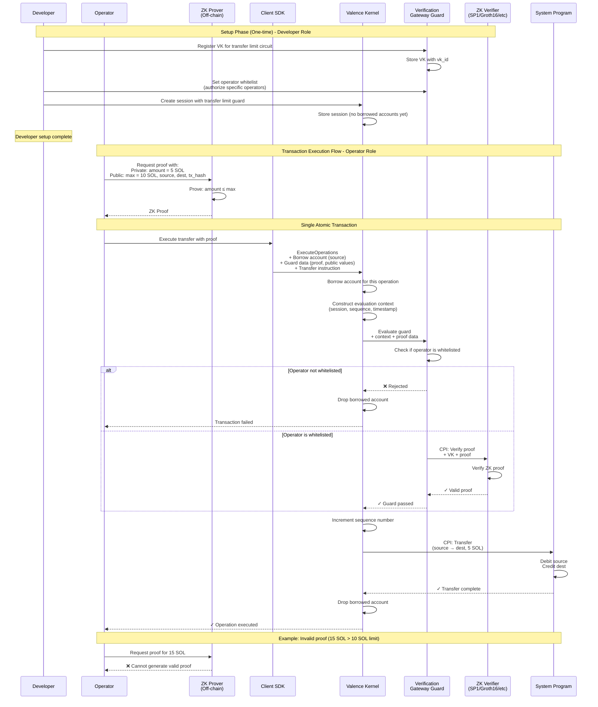

# ZK Transfer Limit Example

This example demonstrates how to use the verification gateway guard to enforce transfer limits on borrowed accounts using zero-knowledge proofs.

## Overview

When you borrow an account in a session, you want to ensure that operations on that account follow certain rules. This example shows how to use ZK proofs to enforce a transfer limit (max 10 SOL) without revealing the actual transfer amount on-chain.

## Architecture



## Key Concepts

### 1. Borrowed Accounts
The session borrows an account (e.g., Alice's wallet) and can perform operations on it, but only if the guard approves.

### 2. ZK Transfer Limits
The ZK circuit proves that a transfer amount is within the allowed limit.

### 3. Operator Whitelist
Only authorized operators can submit proofs and create sessions. This prevents arbitrary users from draining accounts even with valid proofs.

## Usage Flow

### 1. Setup Verification Key

```rust
// Register the ZK circuit's verification key
setup_transfer_limit_guard(
    &client,
    &admin,
    authorized_operators, // Who can submit proofs
).await?;
```

### 2. Generate Transfer Proof

```rust
// Off-chain: prove transfer is within limit
let (proof, public_values) = generate_transfer_proof(
    source_account,
    destination_account,
    amount, // Private: not revealed on-chain
)?;
```

### 3. Create Protected Session

```rust
// Create session that borrows the source account
let session = create_transfer_limit_session(
    &client,
    &operator,
    source_account, // Borrowed by session
    proof,
    public_values,
).await?;
```

### 4. Execute Transfer

```rust
// Transfer executes only if proof verified
execute_limited_transfer(
    &client,
    session,
    source,
    destination,
    amount,
).await?;
```

## Security Properties

1. **Limit Enforcement**: Transfers over 10 SOL are cryptographically impossible
2. **Operator Control**: Only whitelisted operators can create sessions
3. **Account Safety**: Borrowed accounts can only be used within proven limits

## Running the Example

```bash
# Start local validator
solana-test-validator

# Run example
cargo run --example zk-transfer-limit
```

## Extending This Example

### Different Limit Types

1. **Daily Limits**: Prove cumulative transfers < daily limit
2. **Per-Transaction Limits**: Different limits for different operations
3. **Dynamic Limits**: Limits based on account balance or other factors
4. **Multi-Asset**: Limits for different token types

### Advanced ZK Circuits

```rust
// Example: Prove transfer is within 10% of balance
circuit PercentageLimitCircuit {
    // Private
    balance: Field,
    amount: Field,
    
    // Public
    source: Field,
    max_percentage: Field,
    
    // Prove: amount <= balance * max_percentage / 100
}
```

### Integration with DeFi

- **Lending**: Borrow limits based on collateral
- **Trading**: Position size limits
- **Vaults**: Withdrawal limits per epoch
- **Bridges**: Cross-chain transfer limits

## Production Considerations

1. **Proof Generation Time**: Consider UX impact of proof generation
2. **Verification Cost**: Different proof systems have different costs
3. **Key Management**: Secure storage of verification keys
4. **Operator Security**: Careful management of operator whitelist
5. **Circuit Audits**: ZK circuits need security review like smart contracts